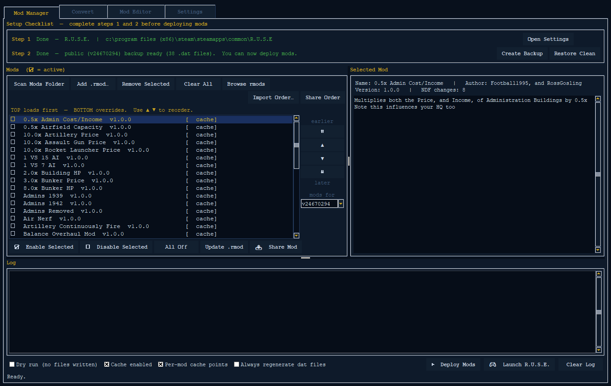
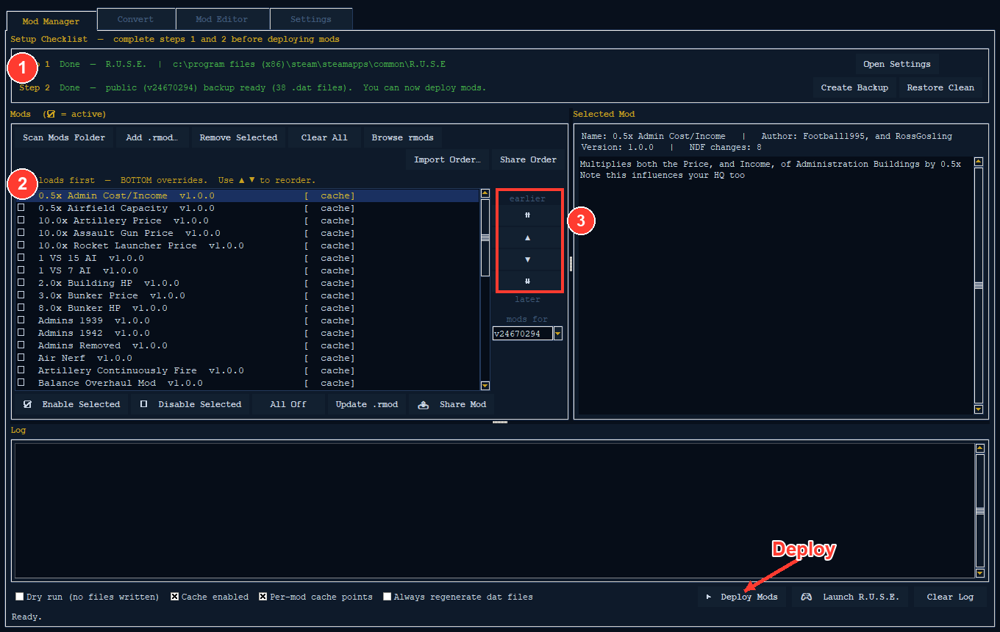
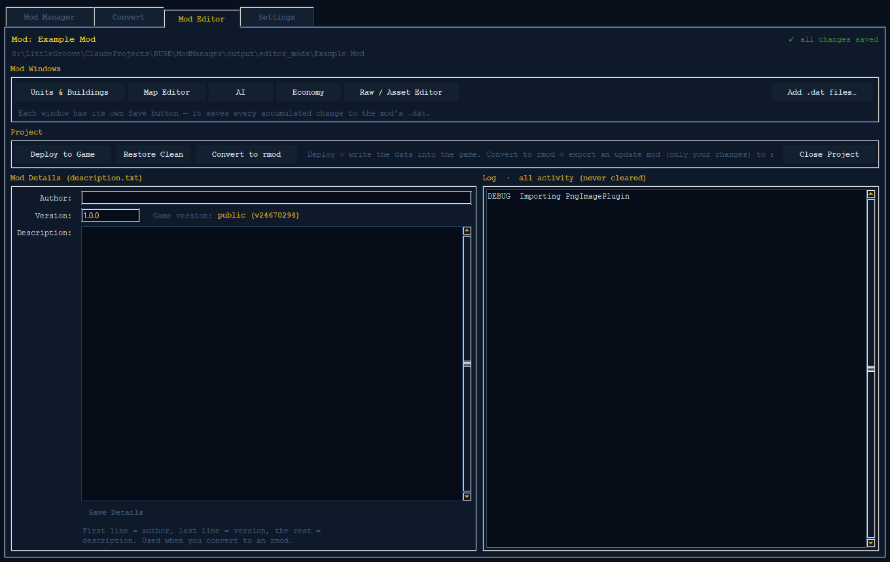
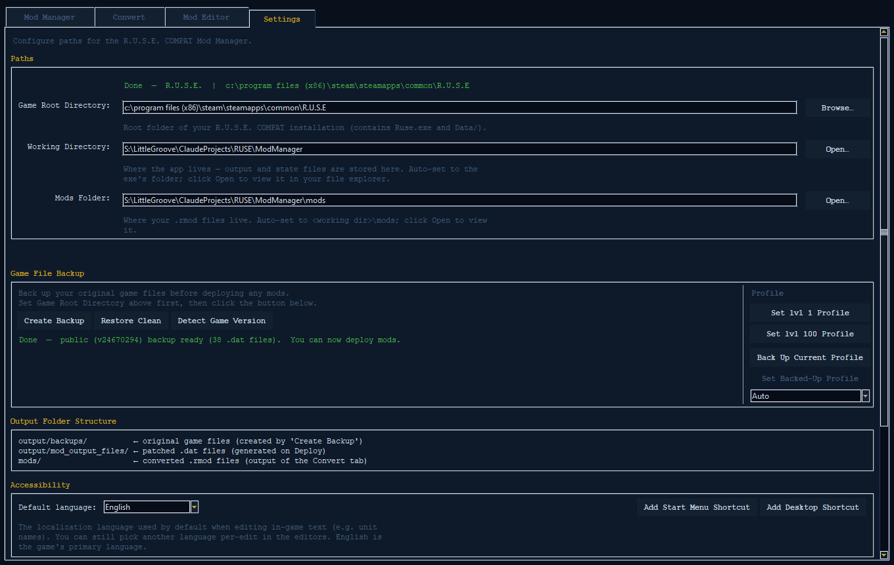

# RUSE Mod Manager

CRITICAL: 1.0.166 fails to load and therefore cant be updated from, grab the new exe and you should not have to worry about updating manually after that

A Windows app that makes modding **R.U.S.E.** way easier. A "mod" is a change you make to the game — like giving a tank more health, or building a new map.

Old-style mods each replaced a whole game file (a `.dat` file — one of the game's big data packs). Two mods that touched the same file couldn't be used together. You had to pick one.

This app fixes that. Its mods are tiny **patch files** — they only write down the exact bits they change. So many mods can be turned on at once and work side by side. And one mod can work on every modern version of the game.

It's also a full **mod-making toolkit**. You can:
- turn old mods into the new kind,
- make a mod work on every game version, or
- build brand-new mods from scratch — change units, the computer players (the **AI**), the game's money and resources (the **economy**), maps, and any other file in the game.

It works with **every modern version of R.U.S.E.** — the one on Steam and each *Compat* version — plus the very first Ubisoft version (**OG Compat**). The app finds your game and version for you.



---

## Contents

- [Just want to play mods? (Players)](#just-want-to-play-mods-players)
- [Download](#download)
- [The problem (and the solution)](#the-problem-and-the-solution)
- [Game versions & branches](#game-versions--branches)
- [The four tabs](#the-four-tabs)
- [📚 Full documentation (deep-dive guides)](#-full-documentation-deep-dive-guides)
- [1. Mod Manager tab](#1-mod-manager-tab)
- [2. Convert tab](#2-convert-tab)
- [3. Mod Editor tab](#3-mod-editor-tab)
- [4. Settings tab](#4-settings-tab)
- [Profiles](#profiles)
- [How updates work](#how-updates-work)
- [The `.rmod` format](#the-rmod-format)
- [Languages](#languages)
- [Running from source](#running-from-source)
- [Contributing](#contributing)
- [License](#license)

---

## Just want to play mods? (Players)

If you just want to **download mods and play**, you don't need the rest of this page. Here are five steps.

### 1. Download it

Go to the **[Latest release →](https://github.com/LittleGroove/RUSE-Mod-Manager/releases/latest)** and download **`RUSE_ModManager_v<X.Y.Z>.exe`**.

That one `.exe` file *is* the whole program. There's **no installer** and **nothing to set up**. You don't need Python or any other software.

### 2. Put it in a folder Windows lets it write to (important)

The app **makes files and folders right next to itself** — like a `mods/` folder for your mods, an `output/` folder for backups (safe copies of your game files) and patched files, and a `settings.json` file. If Windows blocks it from saving there, the app won't work right.

**Do this:** make a normal folder of your own and put the exe inside it. Good spots:

- `C:\Games\RUSE Mod Manager\` — the safest choice; OneDrive never touches it
- Any folder on another drive, like `D:\RUSE Mod Manager\`
- Your Desktop or Documents — **but only if OneDrive isn't in charge of them** (see the OneDrive note below)

**Don't use these — Windows protects them and blocks saving:**

- `C:\Program Files\` or `C:\Program Files (x86)\`
- `C:\Windows\` or anything inside it
- The top of your C: drive (`C:\` by itself)
- Anywhere inside **OneDrive** (like a Desktop or Documents folder that OneDrive has taken over) — OneDrive can make files online-only or read-only, which stops the app from saving next to itself
- Running it straight from inside the `.zip` without unzipping it first

> **⚠ OneDrive can break the app.** On most newer Windows PCs, OneDrive quietly takes over your **Desktop** and **Documents** (and sometimes your whole user folder) and moves them into the cloud. If you put the exe there, it may not be able to make its `mods/`, `output/`, backups, and `settings.json`, so the app fails or acts strange. **Fix:** either put the exe somewhere OneDrive doesn't touch (like `C:\Games\RUSE Mod Manager\` or another drive like `D:\…`), **or** stop OneDrive from managing those folders — see Microsoft's guide, [Back up your folders with OneDrive](https://support.microsoft.com/en-us/office/back-up-your-folders-with-onedrive-d61a7930-a6fb-4b95-b28a-6552e77c3057) (open OneDrive settings → **Sync and backup** → **Manage backup**, and turn the folders **off**). To remove OneDrive completely, see [Turn off, disable, or uninstall OneDrive](https://support.microsoft.com/en-us/office/turn-off-disable-or-uninstall-onedrive-f32a17ce-3336-40fe-9c38-6efb09f944b0).

> **Tip:** Give the exe its **own folder**. You do **not** need administrator rights, and you should **not** "Run as administrator."

### 3. Run it

Double-click the exe. If Windows SmartScreen pops up a blue "Windows protected your PC" box, click **More info → Run anyway**. This shows up only because the app isn't signed by a big company — nothing is wrong.

### 4. Point it at your game (one time)

Open the **Settings** tab. Click **Detect Game Version** to find your game automatically through Steam. Or set **Game Root Directory** yourself — that's your R.U.S.E. install folder (the one with `Ruse.exe` and the `Data/` folder in it). Then click **Create Backup**. This makes a safe copy of your original game files, so you never lose them.

### 5. Add mods and play

- Put any `.rmod` mod files you downloaded into the **`mods/`** folder (or use the **Add .rmod…** button on the Mod Manager tab).
- Check the boxes for the mods you want, drag them into the order you like, and click **▶ Deploy Mods** (this turns them on in the game).
- Changed your mind? Click **Restore Clean** to put the game back exactly how it was.

That's it — start R.U.S.E. and your mods are on. Everything below is extra detail for advanced users and mod-makers.

---

## Download

**[Latest release →](https://github.com/LittleGroove/RUSE-Mod-Manager/releases/latest)**

Grab `RUSE_ModManager_v<X.Y.Z>.exe` for the single all-in-one program, or the `.zip` bundle (the exe + an empty `mods/` folder + some ready-made profiles).

No installer, no Python needed — just download and run. See the **[Players quick start](#just-want-to-play-mods-players)** for where to put the exe so Windows doesn't block it.

---

## The problem (and the solution)

Old RUSE mods replaced whole `.dat` files (the game's big data packs). If two mods changed the same `.dat`, only one could be on at a time — they simply didn't work together. Players had to choose one or the other.

This app brings a new mod type: the **`.rmod`**. It's a small file that writes down *only* the exact changes a mod makes. Instead of saying *"replace this whole pack,"* an `.rmod` says *"find this one unit and change these two things."* Now any number of mods can change the same file without fighting. When two mods try to change the *same* thing, the **load order** (the order your mods are stacked in) decides which one wins.

Because an `.rmod` only lists *changes* — not whole files — the app can also **move the same mod to a different game version** for you. It updates the mod's inner labels to match whichever version you're on.

**Mods survive game updates.** Every built-in mod — and any mod you make yourself with the Convert tab — finds the game parts it changes by *name* (and by which unit, weapon, or turret they belong to), not by *where they sit* in the file. So when R.U.S.E. gets an update and things move around, your mods are far less likely to break. The newest game build ships with a full library of mods too.

---

## Game versions & branches

R.U.S.E. comes in a few different versions. The app keeps them neatly apart using the game's **Steam build id** (a number that names each exact version). This way a mod made for one version never sneaks into another.

| Family | Examples | Data version | Mod extension |
|---|---|---|---|
| **OG Compat** (original Ubisoft version) | `v3591` | `99` | `.compat.rmod` |
| **Modern Compat** (community versions) | `v23661872` (compat-2), `v23660935` (compat-3), `v23738184` (compat-4) | `190852` | `.rmod` |
| **Public** (current Steam version) | `v23762668` | `190852` | `.rmod` |

The app **figures out which version you have** from Steam, and keeps everything sorted by build id:

- backups go in `output/backups/v<buildid>/`
- your mods go in `mods/v<buildid>/`
- each mod project remembers which version it was made for

You don't need to think about this day to day. It just means a compat-2 mod and a public mod never get mixed up, and the app always reads the *right* clean files. When you *do* need to care about it (like making a mod for a version you don't have installed, or moving a mod between versions), the **[Versions & backups guide](docs/guide/versions-and-backups.md)** explains everything.

> **Cross-version mods.** Most modern mods (public + compat-2/3/4) are made once and then **moved** to the others — see the **[Convert tab](#2-convert-tab)**. Only the OG Compat version is its own separate family (it uses `.compat.rmod`).

---

## The four tabs

The app has four tabs across the top:

| Tab | What it's for |
|---|---|
| **Mod Manager** | Turn `.rmod` mods on/off, put them in order, and send them to your game. This is where players spend their time. |
| **Convert** | Turn an old whole-`.dat` mod into a clean `.rmod`, and make a mod work on every game version. |
| **Mod Editor** | Build a mod from scratch — change units, the AI, the economy, maps, and any other file. |
| **Settings** | Game folders, backups, profiles, language, and shortcuts. |

---

## 📚 Full documentation (deep-dive guides)

This page is the **overview and quick start**. Each part of the app has its own guide in **[`docs/guide/`](docs/guide/)** that explains it in full detail — every button, box, and tricky case. The sections below give a quick summary of each area and link to its guide.

| Guide | Covers |
|---|---|
| **[Versions & backups](docs/guide/versions-and-backups.md)** | The build-id system, backups per version, why mods are kept apart, restoring clean |
| **[Mod Manager tab](docs/guide/mod-manager.md)** | Setup checklist, the mod list, load order, deploy, the cache, dry runs, bundled SAFE mods, sharing load orders |
| **[Sharing your mods](docs/guide/sharing-mods.md)** | Sending your own `.rmod` to the community pack with the Share Mod button |
| **[Convert tab](docs/guide/convert.md)** | Turning old mods into `.rmod`, the folder layouts it expects, moving a mod to every version |
| **[Mod Editor — projects](docs/guide/mod-editor.md)** | Making a project, picking a version, the hub, saving, adding `.dat` files, deploy vs. export |
| → [Units & Buildings editor](docs/guide/units-editor.md) | Stats, weapons/ammo, upgrade chains, display names, build menus |
| → [AI editor](docs/guide/ai-editor.md) | Profiles, difficulty handicaps, ruse cards, viewing scripts |
| → [Economy editor](docs/guide/economy-editor.md) | Money, supply, build limits, population, economy buildings |
| → [Map editor](docs/guide/map-editor.md) | Placing things, game modes, start cameras, painting AI terrain, mission scripts |
| → [Raw / Asset editor](docs/guide/raw-asset-editor.md) | Browsing and editing every file in any `.dat`, packs inside packs, searching |
| **[Settings](docs/guide/settings.md)** | Folders, backups, detection, language, shortcuts |
| **[Profiles](docs/guide/profiles.md)** | Backing up your profile per version, using an older profile on a newer game, the level presets |
| **[The `.rmod` format](docs/guide/rmod-format.md)** | Full reference on what's inside an `.rmod` and how moving between versions works |

---

## 1. Mod Manager tab

The main tab: your list of mods, in load order, with a Deploy button.



*① The setup checklist (both steps must be green). ② Your mod list, in load order. ③ The reorder buttons (⇈ ▲ ▼ ⇊). Then **Deploy Mods** turns the checked mods on in your game.*

**Setup checklist.** The top shows two steps that both need to be green before you can deploy: **Set Game Root** (through Settings or **Detect Game Version**) and **Create Backup** (a safe copy of your original files — you can't deploy until it exists). **Restore Clean** puts those originals back any time you want. Re-making a backup is safe: your old backup is never thrown away or lost while a new one is being made.

**It won't crash on a bad mod file.** If a `.rmod` is broken or unusual, the app shows a clear message and keeps going — it doesn't crash or freeze on you.

**Pick which game version's mods to use.** A **build dropdown** (which replaced the old *COMPAT* toggle) lets you choose which R.U.S.E. version's mod library you see and use, newest first. Mods are kept in a separate library for each game version, and the dropdown starts on the version you have installed.

**Adding mods.** **Scan Mods Folder** picks up any `.rmod` files you dropped into your version's `mods/v<buildid>/` folder. **Add .rmod…** copies files in for you. **Remove Selected** / **Clear All** take them back out.

**The mod list.** Each row has a **☑/☐ checkbox**, sometimes a **[SAFE]** tag (a built-in mod that's safe for multiplayer) or a **[COMPAT]** tag (a `.compat.rmod`), and the mod's **name + version**. Click a row to see full details on the right.

**Load order.** Mods apply **top to bottom**, and **the bottom one wins** when two mods clash. Move mods around with **⇈ ▲ ▼ ⇊**. Turn many on or off at once with **Enable/Disable Selected** and **All Off**.

**Deploy.** **▶ Deploy Mods** turns on every checked mod, in order. **🎮 Launch R.U.S.E.** starts the game. **Restore Clean** undoes everything.

**Use older mods on the newest game.** You can turn on a mod made for an older game version and deploy it on the newest one. The app translates the mod's edits across versions for you using built-in version maps. The log tells you when a mod was carried across, and points out any edits the game itself changed in between — those still get deployed.

**Clear warnings when you deploy.** If one of a mod's edits can't find what it's meant to change (a game update moved or renamed it), the mod is flagged **NEEDS REPAIR** and named for you, instead of being quietly skipped. And if two turned-on mods change the *same* thing, the log tells you where one edit is overwriting another, so you can fix the load order.

**Share & import load orders.** **Share Order** copies your on-mods list so you can send it to a friend. **Import Order…** pastes a friend's list back in, and warns you about any mods you're missing or that are for the wrong version.

**Advanced** options sit next to the Deploy button: a **Dry run** (a test that shows what would happen without changing anything), the **deploy cache** (which speeds up deploying by reusing past work — with optional per-mod save points and an "always redo" override), and **bundled SAFE mods** (built into the app to keep multiplayer games matching).

➡ **Full detail: [Mod Manager guide](docs/guide/mod-manager.md).**

---

## 2. Convert tab

The Convert tab does two jobs:


1. **Old mod → `.rmod`.** Point it at the **main folder** of an old whole-`.dat` mod. It compares that mod's files to your clean originals and writes down only what's different, saving a clean `.rmod` into the matching `mods/v<buildid>/` folder. It compares things carefully, one file type at a time (gameplay data, text, map AI info, scenarios), and for anything it can't compare that way, it saves a full copy of the change so **nothing is silently dropped**. Converting is also **safe to interrupt** — if you close the app partway through, nothing is left half-finished. Pick the **target version** from the *"Make mod for version"* dropdown — so you can make a mod for a version other than the one you have installed, as long as you have that version's backup.

2. **Make a mod work on every game version.** The lower panel takes an existing `.rmod`, lets you pick a **Source version**, and then **▶ Converts to all versions**. It re-points the mod's inner labels so they match each version's layout, and saves one `.rmod` per version into its `mods/v<buildid>/` folder. This is how one mod is made to work on public + compat-2/3/4.

➡ **Full detail (including the folder layouts it expects): [Convert guide](docs/guide/convert.md).**

---

## 3. Mod Editor tab

The Mod Editor is a full mod-making toolkit. You make a **project**, edit it using several special windows, then either **deploy** it straight to your game or **export** it as an `.rmod` to share.



**Pick the version when you create.** On the start screen, **Create New Mod** lets you type a name **and choose the game version** from a dropdown of every version you have a clean backup for. It defaults to the version you have installed. So you can make a mod for compat-2 even while your game is on public — the editor always reads that version's clean files.

**The project hub** shows the mod's name, a save-status light, a **Mod Windows** row (one button per editor), an **Add .dat files…** button (import existing `.dat` files into the project — the app sends each one to the right place by its name), a **Project** row (**Deploy to Game**, **Restore Clean**, **Convert to rmod**, **Close Project**), and a **Mod Details** box (which now also shows a read-only **Game version:** — the build the project was made for).

**Saving** is done per window — each editor has its own *Save mod (.dat)* button that writes your changes into the project. **Deploy to Game** copies the project's `.dat` files into your real game (it needs a clean backup of your installed game first, and warns you if your game is set to a *different* version than the project is made for); it no longer scatters per-file backup copies. **Restore Clean** — the same button as on the Mod Manager and Settings tabs — puts your whole game back to unmodded from that backup, so a deploy can always be undone. **Convert to rmod** exports a mod file with only your changes in it.

The five editor windows:

- **[Units & Buildings](docs/guide/units-editor.md)** — stats, weapons/ammo, upgrade chains, the names shown in-game, build menus.
- **[AI](docs/guide/ai-editor.md)** — computer-player profiles, difficulty handicaps, ruse cards, script viewer.
- **[Economy](docs/guide/economy-editor.md)** — money, supply, build limits, population, economy buildings.
- **[Map](docs/guide/map-editor.md)** — placing things, lobby game modes, start cameras, painting AI terrain, mission scripts.
- **[Raw / Asset](docs/guide/raw-asset-editor.md)** — browse and edit every file in any `.dat`, packs inside packs, search.

➡ **Full detail: [Mod Editor guide](docs/guide/mod-editor.md)** (and the per-editor guides linked above).

---

## 4. Settings tab

Game folders (**Game Root Directory**, plus read-only **Working Directory** and **Mods Folder** with **Open…** buttons), backup controls (**Create Backup**, **Restore Clean**, **Detect Game Version**), the **Profile** tools, and **Accessibility** (UI **language**, Start-Menu / Desktop shortcuts).



➡ **Full detail: [Settings guide](docs/guide/settings.md).**

---

## Profiles

R.U.S.E. keeps your campaign and career progress in a file called `PROFILE.ruse`. The app can **back up and restore your profile for each game version**, and it comes with ready-made **level presets** (lvl 1 / lvl 100). These are OG-compat career profiles, but because older profiles always upgrade to fit newer games, they work on **any** version. Restore is smart: it picks the newest profile that fits your version, and it can **use an older version's profile on a newer game** (older profiles upgrade forward; newer ones won't work on older games). An **Auto / specific-version dropdown** lets you choose exactly which saved profile to use.

➡ **Full detail: [Profiles guide](docs/guide/profiles.md).**

---

## How updates work

When you open the app, it checks GitHub for a newer version. If there's a new one, it asks **Yes / No**. **No** closes the app. **Yes** downloads the new exe, swaps out the old one, and reopens. Your `mods/`, `output/`, and `settings.json` are left alone.

If you're offline or GitHub can't be reached, the app quietly skips the check and starts normally. (When you run from source, it never checks for updates.)

---

## The `.rmod` format

An `.rmod` is a plain text file (in a format called JSON) that you can open and edit in any text editor. It records which game version the mod is for (`game_version`), some info about the mod, and a list of **patches** — each one names a `.dat` file, the entry inside it to change, and the **changes** to make (`patch`, `create`, `delete`, `delete_props`). It can handle every kind of game data, and it captures text, map AI info, and scenario changes precisely.

```json
{
  "$schema": "ruse-mod/v1",
  "id": "my-mod", "name": "My Mod", "version": "1.0.0",
  "game_version": "23762668",
  "patches": [{
    "dat": "Data/PC/190852/ZZ_GladPatchableWin.dat",
    "ndf": "genglad/patchable/clustergfx/everything.cpp.gladndfbin",
    "changes": [{
      "action": "patch",
      "table": "TUniteAuSolDescriptor",
      "match": { "ClassNameForDebug": "Unit_Stug_III_B" },
      "set": { "SeuilMort": { "type": "Float32", "value": 600.0 } }
    }]
  }]
}
```

➡ **Full reference (every action, every data type, and how moving between versions works): [`.rmod` format guide](docs/guide/rmod-format.md).**

---

## Languages

The whole app and every editor is translated into **English, French, German, Italian, Spanish, Polish, Czech, Russian, Japanese, and Simplified Chinese**. Choose your language in **Settings → Accessibility → Default language**. When you change it, the app asks whether to restart now to apply it — but your choice is saved either way, so it opens in that language next time even if you don't restart. Each language lives in its own file in the app's `lang` folder (`us.json`, `fr.json`, and so on), so a translation is easy to fix or add to.

---

## Running from source

```bash
git clone https://github.com/LittleGroove/RUSE-Mod-Manager.git
cd RUSE-Mod-Manager/source
pip install -r requirements.txt
python mod_manager.py
```

The runnable source code is in the **`source/`** folder on the `main` branch (look through it to see exactly what goes into each release). The full bundle (`RUSE_Mod_Manager_v<X.Y.Z>.zip`) and the auto-updater exe are on the **[Releases](https://github.com/LittleGroove/RUSE-Mod-Manager/releases)** page. The auto-update check is **turned off** when you run from source.

---

## Contributing

This tool is built together with the community, and your ideas go **straight** into updates — suggestions, bug reports, small tweaks, and big changes are all welcome. Open a **[GitHub Issue](https://github.com/LittleGroove/RUSE-Mod-Manager/issues/new/choose)** (Bug report or Feature / suggestion). Screenshots, which tab or area you were in, the steps to make the bug happen again, your version, and which game version you're on (public / a compat version / OG compat) all help us fix things fast. See **[CONTRIBUTING.md](CONTRIBUTING.md)** for the full rundown.

**Made a mod you want everyone to have?** In the Mod Manager, select it and click **📤 Share Mod** — the app opens the right page and gets your file ready to send, no GitHub know-how needed. See **[Sharing your mods](docs/guide/sharing-mods.md)** for the full walkthrough.

---

## License

RUSE Mod Manager is free software, shared under the **GNU General Public License, version 3** (see [LICENSE](LICENSE)). You may use, study, share, and change it under the GPL's rules. Anyone who shares a changed version must also share it under GPL-3.0 and include the source code. These rules keep the tool — and everything built on it — free and open.

Copyright © 2025 the RUSE Mod Manager authors.

**Bundled third-party software:** the app includes the Python 2.5.1 interpreter (used to rebuild the game's mission scripts) plus other open-source libraries — including the GPL-licensed `uncompyle6`/`xdis` tool (which fits with, and is covered by, this project's GPL-3.0), and freely-licensed NumPy, Pillow, and more. See [THIRD_PARTY_NOTICES.md](THIRD_PARTY_NOTICES.md); the full Python license ships at `ruse_mod_engine/python251/LICENSE.txt`.

---

## Legal & Privacy

**Unofficial fan tool.** RUSE Mod Manager is a fan-made tool for the game R.U.S.E. It is **not** made by, connected to, or approved by Eugen Systems (the studio behind R.U.S.E.). "R.U.S.E." and other game names belong to their owners. This project just helps you change your own copy of the game.

**Use at your own risk.** This tool edits game files on your own computer. It always makes a backup first, and you can put things back, but you use it at your own risk — there is **no warranty** of any kind (see the [LICENSE](LICENSE)). Keep your backups.

**Your privacy.** The app does not track you and does not collect personal information. The only time it goes online is when the packaged app starts up: it asks GitHub once whether a newer version exists. That check sends nothing about you — just a normal web request (your internet address and a fixed app name, the same as visiting a web page). It never sends your files, your game data, or anything you make. If you run the tool from the source code instead of the packaged app, it does not check for updates at all. Nothing else in the app connects to the internet on its own; sharing a mod only happens when *you* choose to, and it opens a GitHub page for you to upload it yourself.
