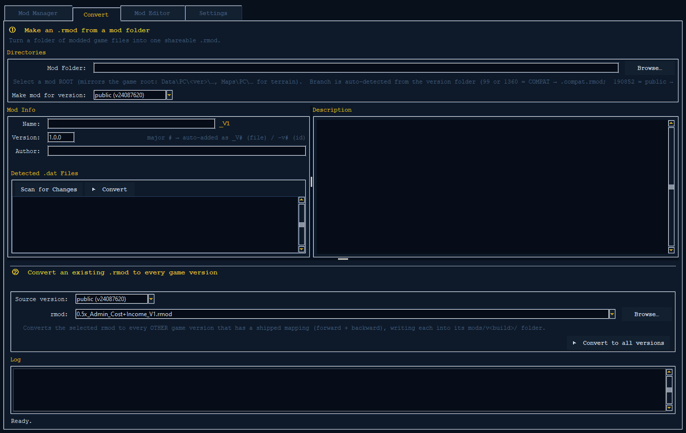
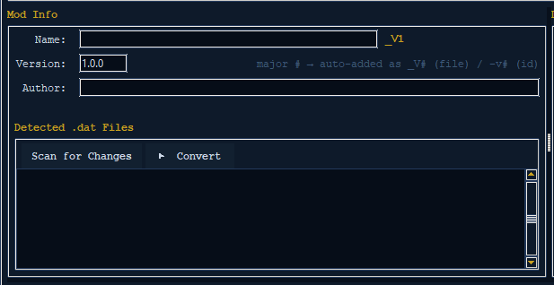
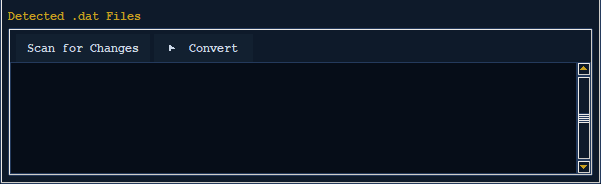
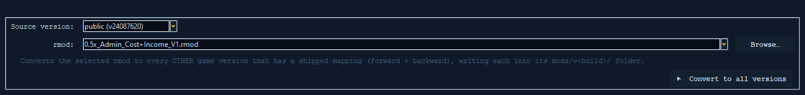

# The Convert Tab

The **Convert** tab makes and shares mods. A *mod* is a change to the game. This
tab does two jobs:

- It turns a *mod folder* — a folder of changed game files laid out just like the
  game — into one small, shareable patch file called an **`.rmod`**.
- It also takes an `.rmod` you already made and copies it so it works on every
  other game version.

There are two separate tools on this tab, stacked one above the other:

1. **Old mod &rarr; `.rmod`** (top): compare a mod folder to your clean game files
   and save the changes as a small patch.
2. **Migrate a mod to every game version** (bottom): take one finished `.rmod`
   and make copies that work on every other game version.



> **Why use `.rmod` at all?** A mod folder holds *whole* game files. An `.rmod`
> holds only the *changes*. That makes it tiny, easy to mix with other mods, and
> easy to move between game versions. See [rmod-format.md](rmod-format.md) to
> learn about the `.rmod` file itself, and [mod-manager.md](mod-manager.md) to
> see how `.rmod`s get added to the game.

---

## Background: game versions and where mods go

R.U.S.E. has had several versions over the years. Each one has its own number,
called a **build id**. The Mod Manager keeps mods separate by build id, so a mod
for one version never gets mixed up with a mod for another.

The versions come in two families. The old original game is one family. The newer
versions are the other. Here they are:

| Version       | Build id      | Data-version | Mod file ends in |
| ------------- | ------------- | ------------ | ---------------- |
| OG Compat     | `v3591`       | `99`         | `.compat.rmod`   |
| compat-2      | `v23661872`   | `190852`     | `.rmod`          |
| compat-3      | `v23660935`   | `190852`     | `.rmod`          |
| compat-4      | `v23738184`   | `190852`     | `.rmod`          |
| public        | `v23762668`   | `190852`     | `.rmod`          |

- **OG Compat** (`v3591`) is the original R.U.S.E. Its game files live in a
  folder named `99` (some are in a folder named `1360`). Its mods end in
  **`.compat.rmod`**. This is its own separate family. You **cannot** convert a
  mod between OG and the newer versions. The tool can move a mod *from* OG *to* a
  newer version, but never the other way (more on this in the Migrate section).
- **The newer versions** (compat-2, compat-3, compat-4, and public) all keep their
  game files in a folder named `190852`. Their mods just end in **`.rmod`**.

When you make a mod, it is saved in its own folder by build id, like
`mods/v<buildid>/`. For example: `mods/v23762668/MyMod_V1.rmod`. See
[versions-and-backups.md](versions-and-backups.md) to learn how the clean copies
of each version (the ones the Convert tab compares against) are made and kept.

---

## Tool 1 — Turn an old mod folder into a `.rmod`

This is the top part of the tab. Here is the plan: **pick the mod folder &rarr;
type in the mod info &rarr; choose the game version &rarr; Scan &rarr; Convert.**

### Step 1 — Pick the mod's MAIN folder

Next to **Mod Folder**, click **Browse…** and pick the mod's **main** folder.
This is the folder that is laid out just like the game. It has a `Data/` folder
inside (and maybe a `Maps/` folder too). The pop-up window title reminds you:

> *Select mod ROOT (mirrors the game: `Data\PC\<ver>\…`, `Maps\PC\…`)*

When you pick a folder, the tab tries to help you:

- If **Name** is still empty, it fills it in from the folder name. (There's no ID
  box — the id is built from the Name for you; see [Step 3](#step-3--fill-in-the-mod-info).)
- If the folder has a proper `description.txt` file, it fills in **Author**,
  **Version**, and **Description** from it. It only fills in boxes you left empty.
  It never erases what you already typed.

Just below the folder box is a **mode line**. It looks at the mod's version folder
and tells you exactly what you are about to make and *where it will be saved*:

- A `99/` or `1360/` folder &rarr; **R.U.S.E. COMPAT mod &rarr; `.compat.rmod`**,
  saved to `mods/v3591/`.
- A `190852/` folder &rarr; **R.U.S.E. (public) mod &rarr; `.rmod`**.
- No version folder it knows &rarr; a warning that tells you to pick the *main*
  folder. (Older or simpler folder layouts still work — see
  [Expected layouts](#expected-mod-folder-layouts).)

The **Convert** button changes its own words to match. It reads
**`▶  Convert to .compat.rmod`**, **`▶  Convert to .rmod`**, or just
**`▶  Convert`**, depending on what the tab found.

### Step 2 — Make mod for version

The **Make mod for version** dropdown picks which **game version** you are making
the mod for. This is the most important choice on the tab, because it decides two
things:

1. **Which clean game files the mod is compared to.** The clean files must match
   the version you are building for, or the changes will come out wrong.
2. **Which `mods/v<buildid>/` folder** the finished mod is saved into.

The dropdown lists **only the versions you have a clean backup for** — one for each
`output/backups/v<buildid>/` folder that has files in it, shown as `branch (vBUILD)`,
newest first. It starts on your **installed version**; if that version isn't backed
up, it starts on your newest backed-up version instead. (Your pick is kept if you
leave the tab and come back.) This is the exact same list and behaviour as the Mod
Editor's **Game version** dropdown.

> **You can build for a version you don't even have installed** — as long as you
> have a *clean copy* of it saved (under `output/backups/v<buildid>/Data/PC/`). The
> dropdown only offers versions you've backed up, so the clean files it compares
> against are always there. To add another version, make a backup of it (from a
> clean, unmodded game) on the Mod Manager tab.

### Step 3 — Fill in the mod info



The **Mod Info** form (on the left of the top part):

| Field           | Notes                                                              |
| --------------- | ----------------------------------------------------------------- |
| **Name**        | Any text — the mod's name that people will read. Used as the start of the file name, and the id is built from it too. |
| **Version**     | `x.x.x` (three numbers with dots, like `1.0.0` or `12.4.30`).     |
| **Author**      | Any text.                                                        |
| **Description** | Can be many lines. It's in the right side of the top part.        |

There is **no ID box**. The id is made from the **Name** automatically (with the
version number added — see below), exactly the way it works when you convert an
open project from the [Mod Editor](mod-editor.md#convert-to-rmod). So both ways of
converting produce the same result.

Two things to know:

- **Version tidy-up.** When you click out of the Version box, anything that isn't
  exactly `x.x.x` (empty, `v1.0`, `1.0.0-beta`, or plain text) is changed back to
  the default **`1.0.0`**.
- **The version number in the file name.** The *first* number (the part before the
  first dot) is added to the **file name** as **`_V#`** and to the **id** as
  **`-v#`**. You'll see the `_V#` as a gold hint next to the Name box; the `-v#` is
  added to the id behind the scenes (there's no id box to show it in). The file-name
  preview line under the form shows the final name, like:

  ```
  → MyMod_V2.rmod
  ```

  The mod's own `name` stays exactly as you typed it. Only the *file name* and
  *id* get the extra number. If a `_V#` or `-v#` is already there, it is removed
  first before adding it again. So converting again never doubles it up
  (`MyMod_V2` stays `MyMod_V2`, not `MyMod_V2_V2`).

### Step 4 — Scan for Changes



Click **Scan for Changes** to see what will be saved before you make the mod. It
goes through the mod folder, matches every game file with its clean copy for the
version you picked, and lists each changed file in the **Detected .dat Files**
box (with its path inside the mod and its size in KB). A status line tells you the
count (*"N .dat file(s) found"*), or *"No matching .dat files found."* if nothing
matches. That last one usually means you picked the wrong folder.

Scanning is optional (it's only a preview), but it's a good idea.

### Step 5 — Convert

Click **▶ Convert** (the button names the file type it will make). The work runs
in the background so the app stays usable, and progress shows up in the **Log**
box at the bottom. When it works, the footer reads *"Written: &lt;file&gt;"* and
the log shows the full path. If it fails, it shows the error or warnings.

Converting is **safe to interrupt.** If you close the app partway through, it
won't leave you with a half-written `.rmod` that won't open.

The finished mod lands in **`mods/v<buildid>/`** for the version you chose. Its
name is `<Name>_V<major><ext>`.

### What Convert actually does

Convert **compares the mod's game files to your clean originals** for the chosen
version. It saves every change as neatly as it can — one file type at a time — so
the `.rmod` stays small and easy to mix with other mods. At the same time, it
makes sure **nothing that changed is ever lost**:

> **Your converted mods are durable across game updates.** When Convert saves a
> change to the game's gameplay data, it records *which* part the change touches
> by its **name** — and by which unit, weapon, or turret it belongs to — instead
> of by its *position* in the game files. Positions shift around every time
> R.U.S.E. updates, but names mostly stay put. So your mods are far more likely to
> keep working after an update, with far fewer edits needing repair. (This is the
> same idea the built-in mods use.)

- **Gameplay data** (`.ndfbin` / `.gladndfbin` / `.truendfbin`) &rarr; it saves
  only the changed pieces. If it can't read the file cleanly, it saves the whole
  changed file instead (safe fallback).
- **Text and translations** (`.dic`) &rarr; it saves only the changed or added
  lines, instead of the whole thing. If a line was *removed* (rare) or the file
  isn't the kind it expects, it saves the whole changed file instead. Because it
  keeps just the lines, mods that **rename units** or **change in-game text** now
  stack cleanly with other mods, instead of one mod replacing a whole text file
  and wiping out another mod's changes.
- **Map AI grid** (`mapinfo.win`) &rarr; it saves only the changed layers.
  Anything outside the part it understands is saved whole (nothing lost).
- **Scenarios** (`.scenario`) &rarr; it saves only the changed unit-placement
  data, when that's the only thing that changed. Other kinds of changes are saved
  whole (nothing lost).
- **Anything else that changed** — or any of the above if the neat version comes
  out empty or unsafe — is saved as a **whole changed file**. This is the safe
  fallback: a changed file is never quietly dropped.

---

## Expected mod folder layouts

The converter needs the mod folder to be **laid out just like the game**. Here are
the standard layouts.

### Newer / public versions (data-version `190852`)

```
MyMod/                                  ← pick THIS folder
└── Data/
    └── PC/
        └── 190852/
            ├── ZZ_GladPatchableWin.dat
            ├── gdconstante.dat
            └── … other core .dat files
    (optional, for terrain / map mods)
└── Maps/
    └── PC/
        └── … map .dat files
```

### OG Compat (data-version `99`)

```
MyOldMod/                               ← pick THIS folder
└── Data/
    └── PC/
        ├── 99/
        │   ├── ZZ_GladPatchableWin.dat
        │   └── … other core .dat files
        └── 1360/
            └── … some files live here
```

> The tab figures out the family by finding a `99`/`1360` folder (&rarr; OG
> compat) or a `190852` folder (&rarr; public) **anywhere** inside the mod folder
> — for core files under `Data\PC\<ver>\…` and map files under `Maps\PC\…` alike.

### Simpler / looser layouts

You don't *have* to put everything inside `Data/`. The converter also accepts and
tidies up:

- A **flat `PC\` layout** (no outer `Data\` folder):
  `MyMod/PC/190852/ZZ_GladPatchableWin.dat`
- A **loose version folder** right at the top: `MyMod/190852/…` or `MyMod/99/…`

If the tab can't find any `99`/`1360`/`190852` folder, the mode line warns you and
the Convert button stays plain. That almost always means you picked a folder above
or below the real mod folder.

---

## Tool 2 — Copy a mod to every game version



The lower **Migrate a mod to every game version** panel takes a **finished
`.rmod`** and makes copies that work on **every other game version** it has a map
for — without redoing the original comparison. This is how one mod is made to work
across **public + compat-2/3/4** from a single source.

### How to use it

1. **Source version** — pick the version your `.rmod` was made for. This dropdown
   lists **every game version you have mods for** (every build with a `mods/v<buildid>/`
   folder — the same set as the Mod Manager tab's build selector), shown as
   `branch (vBUILD)`, or just `vBUILD` for a build with no branch name. Picking one
   makes the rmod dropdown show that version's folder.
2. **rmod** — pick an `.rmod` from the dropdown (it lists the source version's
   folder for you), or click **Browse…** to pick any `.rmod` on your PC.
3. Click **▶ Convert to all versions.**

Progress shows up in the same **Log** box. Each version reports either
*"ok (reindexed N, dropped M)"* or *"skipped — &lt;reason&gt;"*, and the status
line sums it up: *"Done — X converted, Y skipped."* If **nothing** could be
converted — usually because the app has no version maps for the source you picked —
a popup tells you so, instead of the reason only showing in the log.

### What it does

For every *other* game version it knows, it adjusts the mod's inside file paths and
positions to fit that version's layout — going both **forward** (newer) and
**backward** (older). Then it saves one `.rmod` per version into that version's
**`mods/v<buildid>/`** folder, keeping the same file name.

Because it only adjusts paths and positions, the actual *change* data stays the
same. If a mod changes something that no longer exists in another version, that one
change is **dropped and flagged** (it shows up in that version's "dropped" count).
This works using **built-in version maps** that re-point a mod's edits to the right
place for each build — so it does not need any live game files, and one mod can be
produced for every game version.

### OG is its own family

OG Compat (`v3591`, data-version `99`) does **not** swap freely with the newer
`190852` versions:

- The path change from OG to the newer versions only goes **forward**. So a mod
  made for a newer version **can't be turned back into an OG mod**. That's why OG
  is left out of the list when your source is any newer version.
- But an OG mod *can* be spread forward to the newer versions.

In short: build a newer mod once and **Convert to all versions** to cover public
and compat-2/3/4 in one click. OG mods are looked after on their own track.

---

## Quick reference

| Action                       | Control                                   | Result                                  |
| ---------------------------- | ----------------------------------------- | --------------------------------------- |
| Choose the mod               | **Mod Folder → Browse…**                  | Finds the family, fills in Name + info  |
| Choose the game version      | **Make mod for version**                  | Sets what to compare + where to save    |
| Preview the changes          | **Scan for Changes**                      | Lists the changed files                 |
| Build the patch              | **▶ Convert** (`.rmod` / `.compat.rmod`)  | Saves to `mods/v<buildid>/`             |
| Copy a finished rmod         | **Migrate** panel → **Convert to all versions** | One `.rmod` per other version     |

---

### See also

- [versions-and-backups.md](versions-and-backups.md) — game versions and the clean
  backups Convert compares against
- [mod-manager.md](mod-manager.md) — adding `.rmod`s to your game
- [rmod-format.md](rmod-format.md) — what's inside an `.rmod` patch file
- [Project README](../../README.md) — overview of the whole Mod Manager
