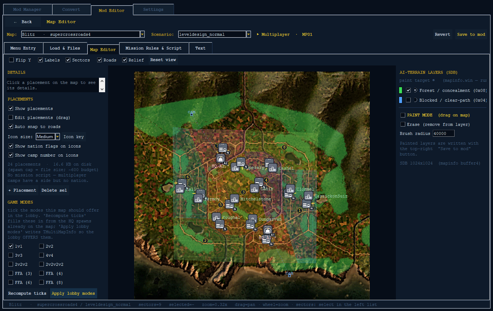

# Map editor

The **Map editor** is a window inside the [Mod Editor](mod-editor.md). It lets you
open any RUSE map along with one of its scenarios (a scenario is one set-up of a
map — where players start, what the objectives are, and so on). You see the map's
small overview picture (the minimap) with the gameplay stuff drawn on top. Then you
can *edit* the things that make the map work: where objects sit (supply depots, HQs,
name labels, trigger zones, and pre-placed units and buildings), which multiplayer
modes the map offers, where the starting cameras point, the special "AI terrain"
layers (which spots hide units or block movement), and the map's mission script.

Everything you do here is saved into your **mod project** (your mod is a set of
changes to the game). It is *not* saved straight into the real game. To try your
changes in-game, you first save into the mod, then use **Deploy to Game** from the
Mod Editor hub.

> The Map editor needs a mod project open. Start it from the Mod Editor hub. The
> editor also needs an image helper installed so it can draw the minimap — without
> it, the minimap won't show.

See also:

- [Mod Editor hub](mod-editor.md)
- [Mod Manager overview / README](../../README.md)

---

## ⚠️ The one big limitation: capture zones are look-only

> **You cannot reshape capture zones in this editor.**
>
> The coloured shapes drawn over the map are the capture zones (the areas players
> fight to control). They are here **just to help you get your bearings**. In the
> real game, capture is handled by a *separate* hidden map of the ground. That
> hidden map is **not** built from these coloured shapes. To change the shape of a
> capture area you would have to rebuild that hidden map from scratch — and **that
> rebuild tool doesn't exist yet**. If you saved changed capture shapes without
> rebuilding the hidden map, the two would no longer match, and the game would
> **crash** the moment it checked a zone or depot.
>
> Because of this, the whole capture-zone panel is **hidden on purpose**, and you
> can't drag the zone edges.
>
> **What you CAN do:** place and move spawns (depots, units, buildings, HQs), set
> name labels and trigger zones, turn multiplayer modes on or off, drag the starting
> cameras, paint the AI-terrain layers (hide / block), and edit the mission script.
> **What you CANNOT do:** change which patch of ground a capture zone covers.

---

## Window layout

The window has a strip along the top that's always there, plus two tabs below it.

**Top strip** (always visible — picking a map and scenario loads *everything*):

| Control | What it does |
| --- | --- |
| **Map:** dropdown | Pick a map. Lists every map the game has. |
| **Scenario:** dropdown | Pick one of that map's scenarios. |
| binding banner | Tells you what *type* the scenario is — Multiplayer / Campaign / Operation / not-set. |
| **Revert** | Throw away unsaved changes and reload the scenario. |
| **Save to mod** | Save *all* your pending changes into the mod project. |

**Tabs:**

- **Map Editor** — the visual editor for placing objects, setting modes, moving
  cameras, and painting AI terrain (this guide).
- **Mission Logic** — the higher-level editor for Operations and missions (only
  available for those scenario types). It opens the script editor and mission
  authoring tools.

---

## Loading a map and scenario, and the overlays

1. Pick a **Map**. The editor loads that map's picture for the minimap and works out
   how to line up map positions with screen pixels. If a sharper background picture
   is available it loads that in the background; otherwise it uses the simpler
   minimap.
2. Pick a **Scenario**. The editor reads in the placements, the roads, the AI-terrain
   layers, and the starting-camera path.

**View toolbar** (on the Map Editor tab):

| Toggle / button | Effect |
| --- | --- |
| **Flip Y** | Flips the map top-to-bottom. Leave it OFF — that's the way that lines up with the map's ground textures. |
| **Labels** | Show or hide the text labels on the markers. |
| **Sectors** | Show or hide the capture-zone shapes. *Look-only.* |
| **Roads** | Show or hide the roads. |
| **Reset view** | Fit the whole map in the window with a little margin around it. |

**Getting around:** roll the mouse wheel to zoom, and left-drag on empty map to move
around. Hover over something to see what it is; click a placement to select it and
fill in the **Details** panel.

---

## Placements

The left **PLACEMENTS** panel controls the placed objects and how you edit them:

| Control | What it does |
| --- | --- |
| **Show placements** | Turn the placement markers on the map on or off. |
| **Edit placements (drag)** | The main edit switch. When ON, you can drag markers and the Details panel becomes editable. When OFF, everything is view-only. |
| **Auto snap to roads** | While you drag a depot or HQ, snap it neatly next to the nearest road (the way the game's own maps place them). |
| **Icon size** | How big the markers are drawn: Small, Medium, Large, or **Off (dots)** if a very busy map gets too crowded. |
| **Icon key** | Open the list of every marker and what it means. |
| **Show nation flags on icons** | Put the little round flags on the corners (see below). |
| **Show camp number on icons** | Put the camp number on the bottom-right corner. |
| **+ Placement** | Open the *Add Placement* popup to make a new placement. |
| **Delete sel** | Delete the placement you have selected. |
| status line | A live count, plus how big the scenario file is (a bigger file fits more spawns; the rough limit is about 600). |

To edit: turn on **Edit placements (drag)**, click a marker to select it, drag it to
move it, and change its fields in the **Details** panel. Then click **Save to mod**.

### Reading the map

Every placement is drawn as a small picture of what it actually is, so you can look at
a map and see the shape of the battle: where the tanks are, which buildings are real
and which are decoys, where the guns point.

The pictures follow one simple pattern:

| Part of the picture | What it tells you |
| --- | --- |
| **The tile colour** | Which family it belongs to — green for infantry, teal for airborne, amber for tanks, rust for artillery, purple for anti-air, blue for aircraft, navy for ships, grey for buildings, dark red for bunkers and gun positions, pink for nuclear. |
| **The shape on the tile** | What it does — a tank, a towed gun, a parachute, a hangar, a pillbox, a truck, and so on. |
| **The small bars along the top** | How heavy it is: one bar light, two medium, three heavy, four super-heavy. A Sherman has two bars, a Tiger has three, a Maus has four. |
| **The mark in the top-right corner** | One extra fact: a **star** for the upgraded version, an **atom** for nuclear, a **crossed circle** for a decoy (a fake building), a **chevron** for anything delivered by air. |
| **The flag on the top-left corner** | The nation the unit itself is from. A Tiger is always German. |
| **The flag on the bottom-left corner** | The nation of the camp that **controls** it. |
| **The number on the bottom-right corner** | Which camp owns it. **N** means neutral (nobody owns it until it is captured) and **X** means it is set to despawn. A placement with **no camp set** shows **0**, because that is what the game treats it as — the first camp. An **HQ** shows **A1**, **A2** and so on, because an HQ belongs to an *alliance* (a team), not a camp — several camps can share one alliance. |

So light, heavy, recon and anti-tank infantry all look different, and paratroopers look
different again. Click **Icon key** for the full list with a short description of each
one.

The two flags are separate on purpose: **who a unit is** and **who is fighting with it**
are not the same thing. A camp can be handed units from another country, so you might see
a German Grenadier with a German flag top-left and an American flag bottom-left. That
tells you at a glance which side of the battle it is actually on.

An HQ shows its alliance's nation only when every camp in that alliance is the same
nation. In many missions they are not (one alliance can hold three different countries),
and in that case no flag is shown rather than a guess at one of them.

Only campaign missions, operations and challenges have nations, because the nation is set
in the mission script. Multiplayer maps have no script — their camps are just lobby slots
with a side, no country — so no bottom-left flag appears on them. The flags also take a
second to show up when you open a scenario, because the script has to be read first.

If a placement is set to a camp *number* that the mission script never defines, the
Details panel says so: **the game silently skips it, so that unit never appears in play.**
That is different from a placement with **no camp set at all** — those are fine, and
belong to the first camp (usually the player's side). Whatever you select is also named in the **Details** panel, under **Type** — handy
when a unit's internal name doesn't tell you much.

Two kinds draw more than a marker: a **circular zone** shows its real radius and a
**rectangular zone** its real width and height, with the icon at the centre. An **HQ**
shows a dashed line to its resting camera.

### Placement kinds

Underneath the pictures, every placement is one of a small number of kinds. The kind
decides which fields it has:

| Kind | What it is |
| --- | --- |
| **Depot** | Supply depot. |
| **Unit** | A pre-placed unit (for campaigns / operations). |
| **Building** | A pre-placed building or defence — **including the real HQ buildings** (`Building_Headquarter`, and the German / British / Soviet / French / Italian / Japanese versions). Pick this, not *Player start*, when you want an actual HQ standing on the map for a particular side. |
| **Spawn (other)** | Any other object owned by a camp (side). |
| **Player start** | Where a player's HQ appears when the match begins, plus its resting camera. It is a *marker*, not a building — the game puts the right HQ there for whatever nation that team is playing, which is why it has no camp of its own. |
| **City label** | A city name label. |
| **Mountain label** | A mountain name label. |
| **Named point** | A plain marker the script can point to by name. |
| **Circular zone** | A round trigger / detection zone. |
| **Rect zone** | A rectangular trigger / detection zone. |

### Details panel fields per kind

The Details panel shows the fields for whatever placement you picked. Fields are
view-only until you turn on **Edit placements (drag)**, which makes them editable.
Every kind also shows a **GEOMETRY** block (position, height, and rotation where it
applies) and an **EDIT** hints block.

| Kind | Key fields |
| --- | --- |
| **Depot** | `Camp` (which side); **Supply** (in-game supply is about 9 times this number); optional name, text, and rotation. |
| **Unit** | its unit type; `Camp`; a `Name` (so a script can refer to it); a raw number; rotation. |
| **Building** | its building type; `Camp`; `Name`; a raw number; some text; rotation. |
| **Spawn (other)** | its type; `Camp`; `Name`; rotation. |
| **HQ** | `AllianceNum` (which team); `AlliancePriority` (the seat within that team — *if it's missing, this is a free-for-all / solo seat*); `Azimut` + `Site` (the start-camera angles); the warmup camera path; the camera position (moves with the HQ); an optional name; and a count of the camera keyframes linked (view-only). |
| **City / Mountain label** | the displayed name; city labels can also carry a `Name`. |
| **Named point** | `Name` (required) — the name scripts point to. |
| **Circular zone** | `Name`; `Radius` (how big the circle is). |
| **Rect zone** | `Name`; `Width`; `Height`. |

**What the `Camp` number means** (the side an object belongs to): blank = Team 1
(for a multiplayer depot, blank specially means *disappear when the match starts*);
`-1` = a neutral object anyone can capture; `-2` = disappear (used in Operations);
any number `N` that's 0 or more = Team N+1. The camps (sides) themselves are set up
in the map's mission script — the number just ties a placement to one of those
camps.

**Rotation is measured in radians** (a way of measuring angles). The Details panel
shows both the radian value and the same angle in degrees. **Depots and HQs are
road-locked:** the game turns them to face the nearest road automatically, so any
rotation you set on them is ignored in-game (the panel tells you this). For the other
kinds, you can edit the rotation.

### Adding a placement (+ Placement)

The popup walks you through:

1. **KIND** — pick one of the ten kinds.
2. **ENTITY CLASS** (only for spawn-type kinds) — search the *full list* of game
   objects, not just the ones already in this scenario. You can filter by category
   and by `all` / `placed` / `unused`, and the list shows how many times each object
   was placed in the game's own scenarios (`* never placed (valid)` marks the objects
   no scenario used but which are still fine to add).
3. **FIELDS** — depends on the kind:
   - depot / unit / building / spawn: `Camp` (may be left blank), and for depots a
     supply number (in-game supply = 9 times the number).
   - HQ: `AllianceNum`, `AlliancePriority`, and a **FFA seat** checkbox (this leaves
     out the priority, for free-for-all).
   - city / mountain: the label text.
   - circle: `Radius`. rect: `Width` + `Height`.
4. **POSITION** — `X` / `Y` on the map (the height fills in automatically from the
   ground near that spot). **Create** drops the placement there; drag it to fine-tune,
   then **Save to mod**.

---

## Game modes (multiplayer)

The **GAME MODES** panel shows up for multiplayer scenarios (and ones with no type
set). Campaign and operation scenarios show a view-only info panel with an **Edit
mission logic…** button instead — their objectives, sides, and win conditions live in
the mission script.

Tick the modes the map should offer in the lobby:

| Tick | Players | Teams |
| --- | --- | --- |
| 1v1 | 2 | 2 teams ×1 |
| 2v2 | 4 | 2 teams ×2 |
| 3v3 | 6 | 2 teams ×3 |
| 4v4 | 8 | 2 teams ×4 |
| 2v2v2 | 6 | 3 teams ×2 |
| 2v2v2v2 | 8 | 4 teams ×2 |
| FFA (3) | 3 | free-for-all |
| FFA (4) | 4 | free-for-all |
| FFA (6) | 6 | free-for-all |
| FFA (8) | 8 | free-for-all |

Each mode needs its own set of HQ start spawns — one HQ per player seat. Free-for-all
modes use one team per player.

**Recompute ticks** — re-reads the current state and updates the checkboxes. It ticks
a mode if the map already offers it in the lobby *and/or* the scenario already has the
right HQ spawns for it. It shows both together, so you can spot any mismatch between
what the lobby offers and what the map actually has.

**Apply lobby modes** — sets up the lobby for the modes you ticked:

1. If a ticked mode is missing HQs, it offers to **set up the HQs** for you — moving
   existing HQs into the right seats and adding any that are truly missing, arranged
   in a ring (drag them where you want afterwards, then Save).
2. It then updates this map's lobby info so the lobby **offers exactly the modes you
   ticked**.
3. If a ticked mode *still* doesn't have its HQs, it **warns you**: the lobby will
   offer the mode, but games won't start until the HQs exist. You can go ahead anyway.

This lobby change is saved into the mod when you click **Save to mod** — it never
touches the real game.

---

## Start cameras

Each HQ has a resting / warmup start camera — the view the player sees during the
countdown before the game begins. It follows the **warmup camera path**, not the
inert camera-position field.

With **Edit placements (drag)** ON and an HQ selected:

- **Drag the HQ** — the base and its camera move together.
- **Drag the `cam` marker** — the camera swings around the HQ on a ring at its set
  distance. Only the *viewing angle* changes (the camera keeps looking at the HQ). The
  whole camera path turns around the HQ and re-aims at it.

The Details panel for an HQ shows the camera angles and how many camera keyframes are
linked.

---

## AI-terrain (SDB) painting

The right **AI-TERRAIN LAYERS (SDB)** panel lets you paint two special layers the game
uses to decide how the ground behaves. There are two layers:

| Layer | Meaning |
| --- | --- |
| **Forest / concealment** | Where the game gives forest cover (units are hidden and can't be seen through). On by default. |
| **Blocked / clear-path** | Whether movement and line-of-sight are blocked or clear. |

Each layer row has a **show ✓** checkbox (turn its overlay on or off) and a **paint
target ◉** button (choose which layer your brush paints).

To paint:

1. Pick the **paint target** for the layer you want to change.
2. Tick **PAINT MODE (drag on map)**. You can also tick **Erase (remove from layer)**
   to rub out instead of add.
3. Set the **Brush radius** (how wide your brush is).
4. Drag on the minimap to paint (or erase) that layer.

Your paint is held in memory until you click the top-right **Save to mod** button (the
panel reminds you). Anything you didn't change stays exactly as it was.

---

## Mission script (`.xyz`)

A mission script is the "brain" of an operation or campaign map — it decides what
happens: when enemies show up, what your objectives are, and how you win or lose. These
scripts are small programs stored inside the game's `.xyz` files. Open the script
editor with **Edit mission logic…** (on the campaign/operation panel) or the Mission
Logic tab.

The editor:

- **Turns the existing script into readable text** so you can edit it (or gives you a
  simple starter template if the scenario has no script yet).
- Gives you a big built-in **REFERENCE pane**, arranged top-down: how the scripts work
  (the object tree, tags, camps) → common edits → ready-to-paste templates → handy
  value tables. Sections cover:
  - **Camps** — how to set up sides (player / scripted AI / neutral), and how the
    order you list the camps lines up with the `Camp` number on placements.
  - **Objectives** — how to win (destroy all enemies / survive a timer), how to lose,
    and endless / no-win modes.
  - **Triggers & timing** — wait some seconds, wait for something to happen, detect a
    unit entering a zone, and run steps one after another, all at once, as a race, or
    branching.
  - **Spawn & unit control** — create units at a named point, move / attack / defend,
    change ownership, wipe out a group.
  - **Variables & state** — make, set, and check numbers.
  - **Quick reference tables** — nationalities, AI levels, difficulties, profiles,
    colours, causes of death, and operator types.
  - Every snippet and recipe has an **insert** button that pastes the example into the
    editor.

Scripts point to things on the map by name: place a Named point / Unit / Zone in the
scenario, give it a unique `Name`, then refer to that name in the script.

**Saving the script:**

- **Save to mod project** — turns your edited script back into the game's format and
  saves it into your mod, ready to test in the game. Your changes really take effect
  in-game. (If you made a typo, it will tell you what's wrong so you can fix it.)
- **Save draft as .py** — saves your script as a plain text file (a `.py` file) so you
  can keep a copy or work on it in another editor. The exact location is shown under
  the buttons.
- **Reload from dat** throws away your changes and loads the original script again;
  **Close** shuts the editor.

See the in-app script reference (in the script editor) for deeper authoring patterns.

---

## Save to mod

The top-right **Save to mod** button gathers up every pending change and saves it into
the mod project — **never** the real game. In one save it stores:

- the **scenario** (placements / depots / HQs / labels / zones);
- the **warmup start camera**, if you moved any cameras;
- your painted **AI-terrain** layers;
- (the lobby **game-mode** change is prepared earlier by *Apply lobby modes* and saved
  along with the rest).

After saving, it clears the "unsaved" marks and reloads from the saved version, so any
further edits build on what you just saved. To put the mod into the game, use **Deploy
to Game** in the [Mod Editor hub](mod-editor.md).

> Reminder: reshaping capture zones is not part of this — that feature is hidden, so
> nothing about capture-zone shapes is ever saved.
