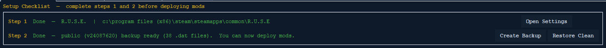
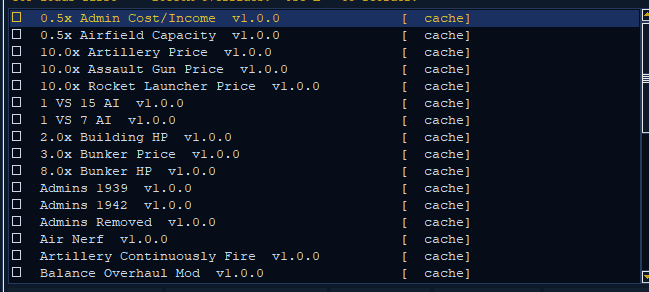
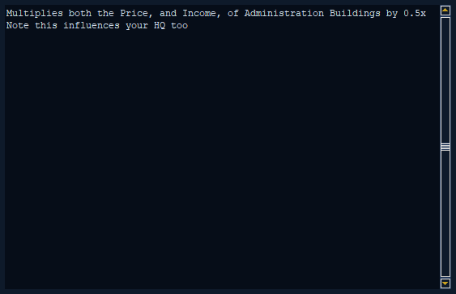
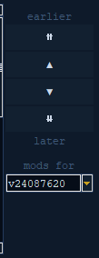
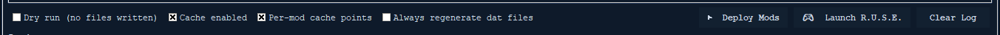

# The Mod Manager Tab

The **Mod Manager** is the first tab of the RUSE Mod Manager. It is where you
actually *install* mods into the game. (A mod is a change you add to the game.)
Everything else in the app (the [Convert tab](convert.md), the Mod Editor, and
[Settings](settings.md)) is there to help you make or set up the `.rmod` files
that you turn on and install here.

This guide walks through the tab from top to bottom: the setup checklist,
building a list of mods, installing them, sharing them, and the extra options.


*① Setup checklist  ② Mod list (in load order)  ③ Reorder buttons — then Deploy Mods turns them on.*

---

## What a mod is

A mod is a single file that ends in `.rmod`. Think of it as a small list of
changes to the game's data files (the `.dat` files, which are the game's data
storage). Instead of replacing whole game files, an `.rmod` only lists the few
things it wants to change. That way, many mods can change the same game file
without erasing each other's work.

Mods **stack** on top of each other. The list you build in this tab is a
**load order** — the order the mods are turned on:

> **TOP loads first — BOTTOM overrides.**

Mods are turned on from the top of the list down. If two turned-on mods change
the **same thing** on the same object, the one **lower** in the list wins for
that one thing. But it only wins for that thing. The mod higher up keeps every
other change the lower mod didn't touch. So layering two mods blends their
changes together, and only the parts that clash are decided by the order.

### Two file types

| Game build | File ending | When it shows |
|---|---|---|
| OG Compat (`v3591`) | `.compat.rmod` | always (in Compat mode) |
| Compat-2 / 3 / 4, Public | `.rmod` | always (in Public-format mode) |

A "build" is one particular version of the game. The app looks at which build
of R.U.S.E. you have. For each build, it keeps its own mods folder and its own
backup (a saved copy of your game files). **Only mods made for the build you
have right now are shown.** If you switch the game to a different build, the
list changes to that build's mods on its own. See
[Versions and Backups](versions-and-backups.md) for more.

---

## The setup checklist (two steps)



At the top of the tab is a two-step checklist. **You can't install mods until
both steps are green.** Skipping them would either fail or could harm your game
install.

### Step 1 — Set the Game Root

Step 1 checks the **Game Root Directory**. That is the folder that holds
`RUSE.exe` and the `Data` folder — in other words, where the game is installed.

| State | What it means |
|---|---|
| **Incomplete** (red) | No game folder set yet. Click **Open Settings**, find your R.U.S.E. install folder, then come back. |
| **Game Root unreachable** (red) | A folder was set, but the app can't find it (maybe its drive was unplugged). Set it again in Settings. |
| **Done** (green) | Shows the version it found (`R.U.S.E.` or `R.U.S.E. COMPAT`) and the folder path. |

The **Open Settings** button takes you straight to the [Settings tab](settings.md).
The game root tells the app which build you have. That in turn picks the right
mods folder, the right backup folder, and the right file type.

### Step 2 — Create a Backup

Step 2 checks for a **clean backup** of the game's files. A backup is a safe copy
of your original game files. The app never changes the game blindly. It installs
mods by layering changed files on top of this clean backup, and **Restore Clean**
copies the backup back. No backup means no safety net, so the app won't let you
install mods.

| Button | What it does |
|---|---|
| **Create Backup** | Copies the game's `Data/` and `Maps/` folders into a backup folder. The `Maps` folder is big, so this can take a while. It runs in the background, and progress shows in the Log. If a backup already exists, it asks if you want to replace it. |
| **Restore Clean** | Copies the backed-up `Data/` and `Maps/` files back over the game. This removes any installed mods and clears the work area. It only works once a backup exists. It asks you to confirm first. |

The Step 2 line shows the branch name, the build id, and how many backed-up
`.dat` files there are. For example: *"Done — Compat-3 backup ready (250 .dat
files). You can now deploy mods."* Both buttons need a working game root before
they turn on.

> **Note:** Each build has its own backup. If you switch builds, you'll need a
> backup for that build too. The app never deletes backups on its own.

---

## Adding mods to the list

The row of buttons above the mod list controls which mods are in your load order.

| Button | What it does |
|---|---|
| **Scan Mods Folder** | Looks in your mods folder for `.rmod` and `.compat.rmod` files made for the current build. It adds any new ones to the **bottom** of the list (turned off). This scan also *offers to label* old or unlabeled mods for the current build so they show up. |
| **Add .rmod…** | Opens a file picker. The files you choose are **copied into** the mods folder, then added to the list. |
| **Remove Selected** | Takes the highlighted rows out of the list. It does **not** delete the files from your disk. |
| **Clear All** | Empties the list. Built-in (SAFE) mods come right back — you can't clear those away. |

A mod only shows in the list if it was made for the build you have installed. A
mod made for a different or older build (or one with no label) is skipped until
you click **Scan Mods Folder**, which offers to re-label it. This keeps the list
honest: what you see is what you can actually install for your build.

---

## Reading the mod list



Each row is one mod, shown in an even-spaced font:

```
☑  [SAFE]  [COMPAT]  My Mod Name  v2.1                    [✓ cache]
```

| Part | What it means |
|---|---|
| `☑` / `☐` | On / off. Click here (or press **Space**) to switch it. |
| `[SAFE]` | A **built-in** mod that comes baked into the app (see below). It's trusted, and it overrides outside mods with the same name. |
| `[COMPAT]` | This mod is a `.compat.rmod` (the OG Compat file type). |
| name + `v…` | The mod's name and version, read from the file. |
| `[✓ cache]` / `[ cache ]` | A marker on the far right. It only shows when *Per-mod cache points* is turned on (see the extra options). |

Clicking a row fills the **Selected Mod** panel on the right. It shows the mod's
name, author, version, how many changes it makes, and its description.



> The header reads **"Mods (☑ = active)"**, and a reminder line says
> *"TOP loads first — BOTTOM overrides. Use ▲ ▼ to reorder."*

### Pick which game version's mods to use

At the top of the mod list is a **build selector** dropdown. It lets you choose
which R.U.S.E. version's mod library to see and use, newest first. Your mods are
kept apart by game version, so switching the dropdown just shows that version's
list.

It starts on the version of the game you have installed. If that version has no
mods yet, you'll see a short message, and you can pick another version from the
dropdown. Your pick is kept while you move around the app. The pick covers both the
built-in mods and your own folder mods.

---

## Ordering the load order



A column of buttons to the right of the list moves the **one mod you have
selected**. The column is labeled **earlier** at the top and **later** at the
bottom, to match "top loads first."

| Button | What it does |
|---|---|
| ⇈ | Move the selected mod to the **top** (loads first). |
| ▲ | Move it up one spot. |
| ▼ | Move it down one spot. |
| ⇊ | Move it to the **bottom** (overrides everything above it). |

Because the bottom wins, put the mod whose changes you most want to keep
**lower** in the list. The order is saved to disk right away.

---

## Turning mods on and off

Only mods that are **on** (`☑`) get installed. The on/off buttons below the list:

| Button | What it does |
|---|---|
| **☑ Enable Selected** | Turn on all highlighted rows. |
| **☐ Disable Selected** | Turn off all highlighted rows. |
| **All Off** | Turn off every mod in the list. |
| **Update .rmod** | Rebuilds the one selected **outside** mod for your current build and file type. It's off unless exactly one non-built-in mod is selected. |

You can also switch a single row by clicking its `☑/☐` box or pressing **Space**
on the selection. Hold `Ctrl` or `Shift` to pick more than one row, like any
normal list.

---

## Deploying, launching, restoring



The button bar at the bottom of the tab holds the main actions.

| Button | What it does |
|---|---|
| **▶ Deploy Mods** | Installs every turned-on mod, in order, onto the game. ("Deploy" just means install the mods.) It won't run unless a game root is set **and** a backup exists **and** at least one mod is on. It runs in the background — watch the Log. |
| **🎮 Launch R.U.S.E.** | Starts the game from the game root. It's off while a deploy or backup is running, or if no game root is set. |
| **Restore Clean** | (also in Step 2) Puts the game back to the clean backup, removing all installed mods. |

### What Deploy actually does

1. Checks the game root and backup, and gathers the turned-on mods in list order.
2. Adds any hidden **predeploy** patch mods for this build (see below).
3. Applies each mod's changes to the **clean backup**, building the changed
   `.dat` files in a work area (reusing saved work where it can).
4. Puts back any leftover `.dat` files a *past* deploy changed but this set no
   longer touches, so the game never keeps old changes.
5. Layers the freshly built `.dat` files onto the live game and remembers exactly
   which files are now changed.

The Log prints what each mod did — every change as `table[id].prop: old → new`,
plus any warnings and errors, and a final line like *"Done — N change(s),
W warning(s), E error(s)."*

> **Deploying again** with a different list is safe. The last deploy's changes
> are undone before the new ones go on, so you never need to Restore Clean
> between deploys.

### When a mod needs repair

Sometimes one of a mod's changes can't find the thing it's meant to change —
usually because a game update moved it or gave it a new name. When that happens
during a deploy, the Mod Manager now says so clearly. It marks the change
**NEEDS REPAIR** and names it in the Log, instead of quietly skipping it. So a
mod that's out of date for your game version no longer fails without telling you.

### When two mods clash

If you turn on several mods that change the **same** unit or building stat (say
two balance mods that both set a tank's HP), only the last one really takes
effect. During a deploy the Mod Manager now points out exactly where that
happens — it tells you *"this edit overwrites an earlier mod."* That way a stack
of mods can't quietly cancel itself out without you knowing.

### Using mods made for an older game version

If you pick a build whose mods were made for an earlier version and deploy them
onto your current game, the Mod Manager now carries them across versions for you.
It uses built-in **version maps** to translate the changes, so the mods keep
working with no loss of function. The Log tells you when a mod was carried across
versions, and it flags any of that mod's changes that point at values the game
changed in between — so you know which mods are worth updating. Either way, they
still deploy.

---

## Sharing and importing a load order

These two buttons let you copy an exact load order onto another computer. This is
a must for multiplayer, where everyone has to run the same mods.

### Share Order

Copies your **turned-on** mods, in order, as plain text to your clipboard. For
example:

```
=== R.U.S.E. Load Order ===
1. My Balance Mod | v2.1
2. [COMPAT] Old Campaign Tweaks | v1
=== End Load Order ===
```

If no mods are on, it tells you there's nothing to share. Paste this to a friend
in a chat.

### Import Order…

Opens a window where you paste in a shared order. (It fills in from your clipboard
if what's there looks like an order.) Then you click **Check & Apply**. The
manager:

- **Checks the game version.** If the order was made for the other file type
  (say a COMPAT order while you're on Public), it refuses and tells you to switch
  in Settings.
- **Matches each line** to your installed mods by name and file type:
  - `OK` — you have that exact mod at the asked-for version.
  - `VERSION` (warning) — you have the mod, but a different version. It's still
    added, marked as a mismatch.
  - `MISSING` (error) — you don't have that mod at all.
- **Rebuilds your list.** Matched mods are turned on and put at the top in the
  shared order. Everything else (including any SAFE mods the order leaves out) is
  moved below and turned **off**.

If the shared order has compat mods while you're on Public, the build selector
switches to that version by itself so they show up.

---

## Extra options

The checkboxes on the left of the button bar change *how* a deploy is built. The
default settings are good for most people. You rarely need to change them.

| Option | Default | What it does |
|---|---|---|
| **Dry run (no files written)** | off | Applies every change and logs it **without writing anything** to the game or the saved work. Use it to preview what a load order would do. |
| **Cache enabled** | on | The main switch for saving deploy work (below). When off, every deploy redoes all the work from scratch — slower, but it never reuses saved work. |
| **Per-mod cache points** | on | When on, each row shows a `[✓ cache]` marker (see below). When off, only the full deploy result is saved. |
| **Always regenerate dat files** | off | Forces a full rebuild from the backup, skipping *reuse* of saved work — but it still saves the new work after. Use this if you think the saved work is out of date. |

### The deploy cache

Building the changed `.dat` files is the slow part of installing. The cache
(saved work) speeds up repeat deploys with a **longest-unchanged-start** idea:

- Mods apply in order, so the saved result of the first few mods is a good
  starting point for applying the rest.
- On deploy, the app looks for the **longest run from the start** of your list
  that's already saved. (It tries the whole list, then drops the last mod, and so
  on.)
- The longest match becomes the base, and only the **rest** of the mods get
  applied on top. A full match means *no work at all* — the saved files go
  straight onto the game.

If you edit any mod, the app notices and throws out the saved work that used it.
Saved work is kept per **build**, so two builds never mix up each other's work.
**Dry runs never read or write the saved work.**

**What gets saved** (to keep disk use in check):

- *Per-mod cache points OFF* → only the final, full-list result is saved.
- *Per-mod cache points ON* → only the runs that **end at a mod you've ticked**
  with its `[✓ cache]` marker are saved. Tick the points you switch around the
  most (for example, the line between your steady base mods and the ones you keep
  testing) so re-deploys can reuse everything up to that point.

### Built-in (SAFE) mods

The app can carry `.rmod` files **baked right into itself**. These show in the
list with a `[SAFE]` tag:

- They're **trusted** and are the standard for keeping multiplayer the same for
  everyone.
- A SAFE mod **overrides (hides)** any outside mod with the same name and major
  version, so everyone running the app gets the exact same files.
- You can't clear them away or remove them (Clear All brings them back), and you
  can't **Update .rmod** them (they're baked in).
- You **can** turn them on and off. Your on/off choice and where they sit in the
  list are remembered across restarts.

If you run the app straight from the source with no built-in mods, there simply
are no SAFE mods, and every mod acts like a normal outside one.

### Auto-applied "predeploy" patch mods

Some builds ship an **unofficial patch** as one or more predeploy `.rmod` files.
These are also baked into the app and matched to the build you have. They are:

- **Hidden** — they never show in the mod list, so you can't see, reorder, or
  turn them off.
- **Applied first**, before your mods and before SAFE mods, so everything you
  turn on layers on top of them.
- Saved (cached) like SAFE mods.

They're there to add fixes the build needs no matter which mods you pick. You
don't have to manage them.

---

## The Log

The bottom pane is a color-coded **Log** that shows only Mod Manager activity:

| Color | What it means |
|---|---|
| Heading | Section markers (deploy start, per-mod headers, summaries). |
| Green (ok) | Steps that worked and changes that were applied. |
| Yellow (warn) | Warnings that aren't fatal (like a version mismatch or a missing backup file). |
| Red (err) | Errors. |
| Dim (info) | Detail lines (single files, cache notes). |

**Clear Log** (on the right of the button bar) empties it. The line under the Log
shows a short status (*"Ready."*, *"Deploying mods…"*, the deploy summary, and
so on).

---

## Quick start

1. **Settings** → set the **Game Root Directory** (Step 1 turns green).
2. Back on this tab, click **Create Backup** and wait (Step 2 turns green).
3. **Add .rmod…** or **Scan Mods Folder** to fill the list.
4. Tick the mods you want and put them in order (bottom overrides).
5. **▶ Deploy Mods**, then **🎮 Launch R.U.S.E.**
6. To go back to the plain game, click **Restore Clean**.

---

## See also

- [Versions and Backups](versions-and-backups.md) — how builds work, multiple
  builds, and managing backups.
- [Convert tab](convert.md) — how to make `.rmod` files from mod folders.
- [Settings](settings.md) — game root, folders, language, version detection.
- [Project README](../../README.md) — an overview of the whole app.
