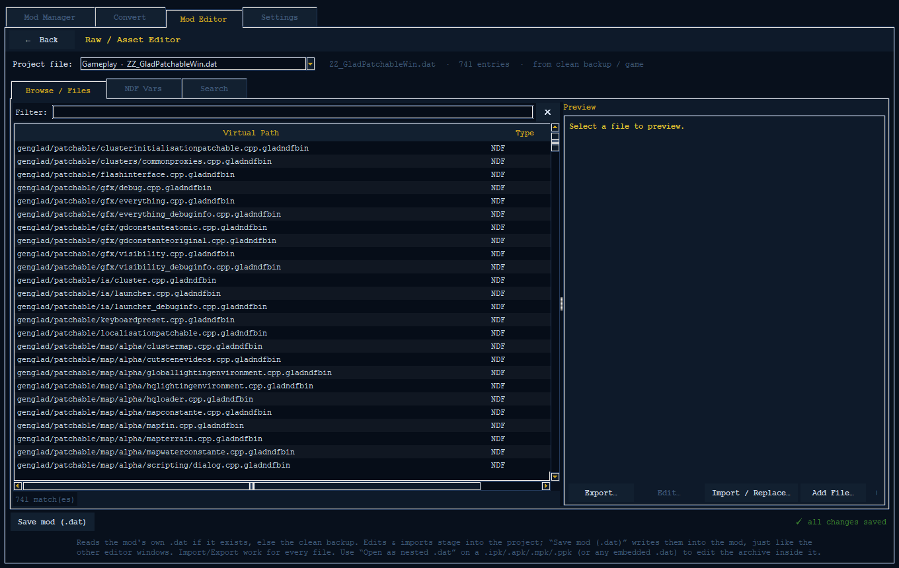
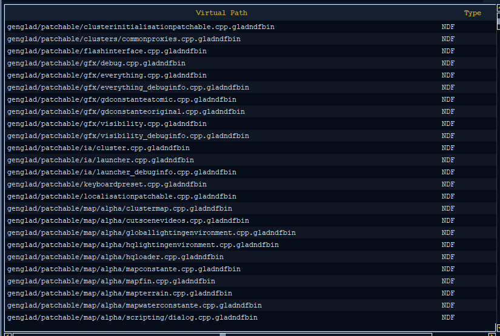
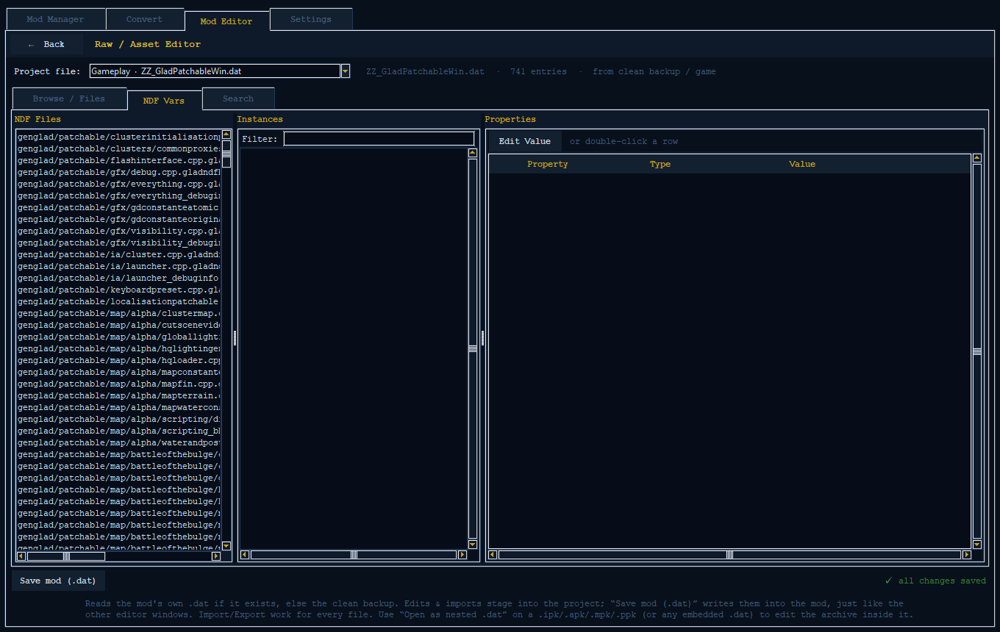
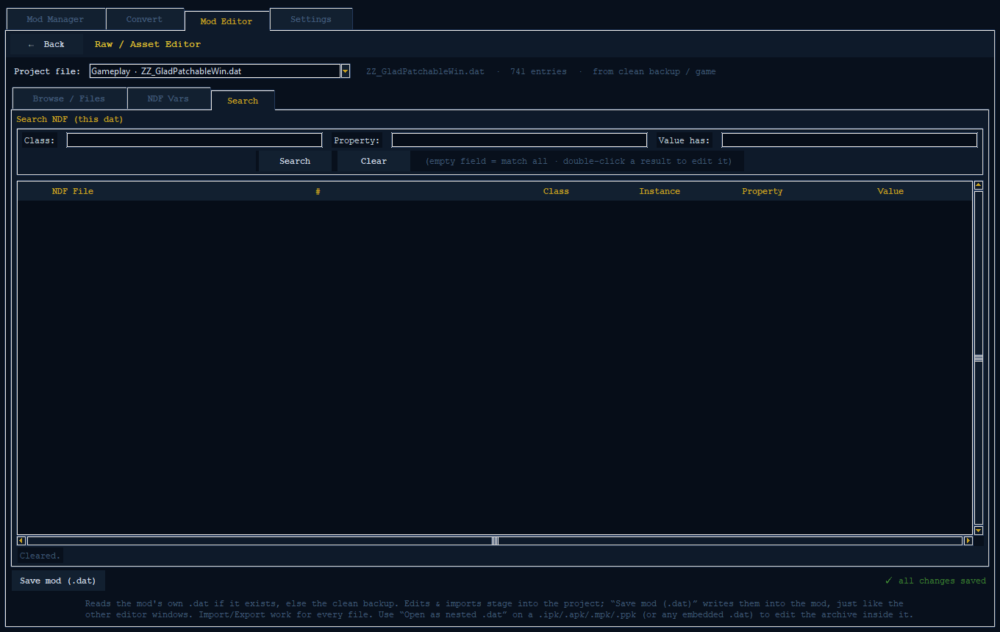

# Raw / Asset Editor

The **Raw / Asset Editor** is the "everything" window inside the Mod Editor. The
special editors (Units, Economy, AI) give you a friendly view of a *few* well-known
files. The Raw / Asset Editor instead shows you **every single file inside any of the
game's `.dat` archives** (a `.dat` is a big pack file that holds lots of game files
inside it). Here you can preview a file, save it out, replace it, add a new one, and
even open packs that are stored *inside* other packs — as deep as they go.

If a special editor can't reach the thing you want to change, this is the tool that
can.

See also: [Mod Editor overview](mod-editor.md) · [Units editor](units-editor.md) ·
[rmod format](rmod-format.md) · [Project README](../../README.md)

---

## When to use it

Reach for the Raw / Asset Editor whenever:

- You need a file the special editors don't show — textures (pictures), localization
  tables (the game's text), AI scripts, map/terrain data, video, fonts, scenario
  files, or any raw file.
- You want to **save a file out** to look at it in another program, or **bring one in**
  to replace a file with your own.
- You want to **add a brand-new file** at a folder path you choose inside a `.dat`.
- You need to edit a pack that lives *inside* another pack (a renamed `.ipk` / `.apk` /
  `.mpk` / `.ppk`, or any pack tucked inside a `.dat`).
- You want to search a whole `.dat` for game objects by their type, a property, or a
  value, or hand-edit a property the unit / economy / AI editors don't show.

### How it reads and saves

You open this window from the Mod Editor hub with a project loaded, and it works on
**the same project** as the Units / Economy / AI windows:

- It reads each game file from **your mod's own `.dat`** if one exists, otherwise from
  the **clean backup** (or the live game).
- All your edits and imports are **held in the project** — nothing is written to disk
  until you Save.
- Its single **Save** writes every change you've made into the mod's `.dat`, just like
  the other editor windows.

Because the NDF Vars tab changes the **shared** game objects, edits you make there
**combine** with the special editors: a value you change here and a value the Units
editor changes both end up in the same saved file.

---

## The Project file (dat) picker

At the top of the window is a **Project file:** dropdown. It lists, in this order:

| # | Picker label                                          | What's inside |
|---|-------------------------------------------------------|---------------|
| 1 | Gameplay · `ZZ_GladPatchableWin.dat`                  | Units, economy, menus — the main gameplay data |
| 2 | Gameplay (non-patchable) · `ZZ_GladNotPatchableWin.dat` | Gameplay data that can't be patched |
| 3 | AI Scripts · `IA_Common.dat`                          | AI behaviour and the AI scripts |
| 4 | Maps · `DataMap_Win.dat`                              | Map info and scenario / placement data |
| 5 | Localization / Textures · `ZZ_Win.dat`                | The game's text tables and textures |
| 6 | Common (video / fonts) · `Data_Common.dat`            | Video, fonts, and shared files |

After those six **main dats**, the picker also adds **every per-map terrain dat** it
finds, each labelled **Terrain map · `<name>`**. These work exactly the same way — you
edit and save them just like the main dats.

To the right of the dropdown, a status line shows the picked dat's file name, how many
files it holds, and where it was read from — **`mod copy`** (in gold) when you're
editing your mod's own `.dat`, or **`clean backup / game`** when reading the untouched
original.

Switching the picker reloads the file list, the NDF file list, and clears the search
results.

---

## The three tabs

The window has three tabs for working on the dat you picked: **Browse / Files**, **NDF
Vars**, and **Search**.

---

## 1. Browse / Files

This is the main view: a searchable list of **every file** in the chosen dat on the
left, and a live **Preview** on the right.

### The entry list

The list has three columns — **Virtual Path** (the file's folder path inside the dat),
**Type**, and **Size** (in bytes). A **Filter:** box at the top narrows the list by
typing part of the path (upper/lower case doesn't matter); the `✕` button clears it.
The list shows at most 6,000 rows — if there are more matches you'll see a "showing
first N — narrow with Filter" note, so use the filter to zero in.

The **Type** column is guessed from the file's ending:

| Type label        | File endings                                              |
|-------------------|----------------------------------------------------------------|
| `NDF`             | `.gladndfbin`, `.ndfbin`, `.truendfbin`                        |
| `Texture (TGV)`   | `.tgv`, `.tgv_pc`                                               |
| `Image`           | `.png`, `.jpg`, `.jpeg`, `.bmp`, `.gif`, `.tga`, `.dds`        |
| `Localization`    | `.dic`                                                          |
| `AI Script`       | `.xyz`                                                          |
| `Text`            | `.xml`, `.txt`, `.ndf`, `.lua`, `.cfg`, `.ini`, `.csv`, `.json`, `.scenario` |
| `Nested .dat`     | `.ipk`, `.apk`, `.mpk`, `.ppk`, `.dat`                          |
| `Binary`          | everything else                                                |

### The live Preview

When you select a file, the preview shows it in a way that fits its type (for packs
inside packs, it checks what the file really is, not just its ending):

| Kind              | Preview shown |
|-------------------|---------------|
| **NDF**           | A summary: how many objects and object types it has, how many property names, whether it's compressed, and the top 12 object types by count. An **Edit these vars in the NDF Vars tab →** button jumps straight to the NDF Vars tab for this file. |
| **Texture (TGV)** | A decoded **thumbnail** (up to 720×600) with its `width×height format`. Textures in a format the tool can't decode show a raw byte view instead. |
| **Image**         | A thumbnail of a normal PNG/JPG/etc., with its `width×height`. |
| **Localization**  | The text table, shown as a list of `key → text` rows (up to 4,000 rows; save it out to see all of them). |
| **AI Script**     | The script shown as readable text where possible. If it can't be read that way, a raw byte view with a note to save it out. |
| **Text**          | The text, decoded. Also used for any file that *looks* like text. |
| **anything else** | A raw byte view (first 8,192 bytes, with a "… N more bytes" note) and a hint to Export / Import. |

If the image helper isn't installed, texture and image previews say so and show the raw
bytes instead.

> Note: texture and image previews need the image helper; without it the preview says
> so and shows raw bytes instead.

### Buttons (bottom of the Preview pane)

#### Export…

Saves the selected file out to a spot you choose.

1. Select a file in the list.
2. Click **Export…**.
3. Pick where to save it (the file's name is filled in for you).

If you already replaced or added this file, it saves your new version; otherwise it
saves what's on disk — so you can save out a file you just added even before you Save.

#### Import / Replace…

Sets up a replacement for the selected file. **Nothing is written to disk until you
Save.**

1. Select the file you want to replace.
2. Click **Import / Replace…** and choose a file.
3. Confirm the replace prompt.

The new size shows in the list right away, and the unsaved-changes marker updates.

#### Add File…

Adds a **brand-new** file at a folder path you choose.

1. (Optional) Select an existing file — its folder becomes the default for the new
   path.
2. Click **Add File…** and choose the file on your computer to add.
3. In the **Add** dialog, type the **path inside the .dat** — use the game's folder
   layout, for example `pc\ndf\patchable\gfx\myfile.ndfbin`.
4. Click **Add**.

Add won't accept an empty path or one that already exists (use **Import / Replace…** to
overwrite instead). The new file shows up in the list, already selected, and is held
until you Save.

#### Open as nested .dat →

A `.ipk` / `.apk` / `.mpk` / `.ppk` (or any `.dat` inside a dat) is **itself** a pack.
This button turns on **only** when the selected file really is a pack — it checks what
the file truly is, not just its ending, so a renamed pack is still found.

1. Select a pack file (the button turns on).
2. Click **Open as nested .dat →**. A new Raw / Asset Editor view opens on a working
   copy of that pack.
3. Browse / edit / import inside it just like the top-level dats. This works **as deep
   as you need** — a pack inside a pack inside a pack opens the same way.

#### Apply into parent .dat (nested windows only)

When you're inside a pack-in-a-pack, the Save button is renamed **Apply into parent
.dat**. Clicking it:

1. Rebuilds the pack you edited.
2. Puts that rebuilt pack back into the **parent** window, replacing the file it came
   from.
3. Does **not** write to disk — you then switch back to the parent window and **Save**
   there to write the change into the real `.dat`.

> Limitation: some older pack versions can't have files *added* to them — replacing
> files one at a time still works, but Add File may not be available for that pack.

---

## 2. NDF Vars

This tab lets you drill down **NDF file → object → property** and change any property's
value with a simple dialog. Because it changes the **shared project objects**, edits
here combine with the Units / Economy / AI editors — they're all working on the same
underlying objects.

The tab has three panes:

1. **NDF Files** — every NDF file in the current dat.
2. **Instances** — every object in the selected file, labelled `[index] ClassName
   (ClassNameForDebug)`, with a **Filter:** box to narrow the list by typing.
3. **Properties** — the selected object's properties, in a table with **Property**,
   **Type**, **Value**, and an *edited* (`✎`) marker column. Properties you've changed
   are highlighted in gold.

### Editing a value

1. Select an NDF file, then an object, then a property.
2. Click **Edit Value** (or **double-click** the property row).
3. In the dialog: you can change the **Type** if you need to (it starts on the
   property's current type), see the **Current** value, and type the **New value**.
4. Click **Apply**.

You can edit whole-number, decimal, true/false, text, path, color, and multi-number
value types. Multi-number types (like a position or a color) are typed as numbers
separated by commas (brackets are optional, e.g. `1.0, 0.5, 0.0`). Text and path
values are stored back for you automatically.

Your change is read in, written onto the object's property, marked as unsaved in the
project, and the row gets its `✎` marker. If the value doesn't fit the chosen type, the
dialog tells you what's wrong and nothing is changed.

---

## 3. Search

The Search tab finds **objects by type / property / value** across the **whole dat** at
once.

The form has three fields:

- **Class:** — match part of the object's type name.
- **Property:** — match part of a property name.
- **Value has:** — match part of the shown property value.

A **blank field matches everything**. Click **Search** to run it (it runs in the
background so the window stays responsive), or **Clear** to reset. Results are capped at
5,000 rows.

Each result row shows **NDF File**, **#** (the object's index), **Class** (its type),
**Instance** (its debug name), **Property**, and **Value**.

**Double-click a result** to jump right to it in the **NDF Vars** tab — the editor
switches tabs, picks the right NDF file, and highlights the matching object with its
properties ready to edit.

---

## Saving

The bottom-left **Save mod (.dat)** button writes **all your held changes** — value
edits, imports, adds, and applied nested packs — into the project. The status line at
the bottom-right shows **`● N unsaved change-set(s)`** (gold) while you have changes
waiting, or **`✓ all changes saved`** (green) once everything is written. After saving,
the current dat is reloaded so the list and sizes match what was just written.

In a **nested** window the same button reads **Apply into parent .dat** instead (see
above) — it hands the changes back up to the parent instead of writing to disk.

> Tip: if Save fails, check that the **Game Root** is set in Settings — the editor
> needs the clean original files to build your mod's `.dat`.

---

## Summary

| Action | Tab | Button |
|--------|-----|--------|
| Look at any file with a live preview | Browse / Files | (select a file) |
| Save a file out to disk | Browse / Files | Export… |
| Replace a file's contents | Browse / Files | Import / Replace… |
| Add a new file at a path you choose | Browse / Files | Add File… |
| Edit a pack that's inside a dat | Browse / Files | Open as nested .dat → |
| Fold a nested pack's edits back up | (nested window) | Apply into parent .dat |
| Hand-edit a single NDF property | NDF Vars | Edit Value / double-click |
| Find objects across the whole dat | Search | Search |
| Save everything into the mod | (any tab) | Save mod (.dat) |

For the bigger picture of how this window fits the project-based workflow, see the
[Mod Editor overview](mod-editor.md); for the friendlier unit-specific path see the
[Units editor](units-editor.md); and for how mods are packaged see the [rmod format](rmod-format.md) guide
and the [project README](../../README.md).
