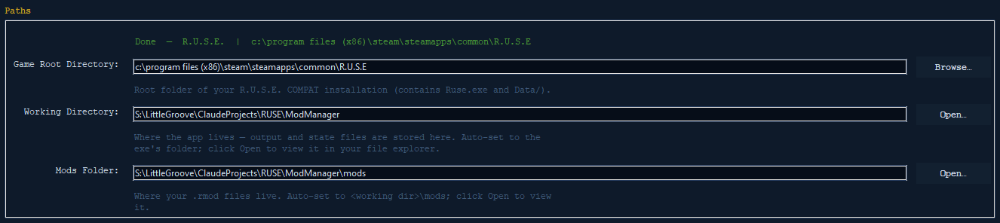
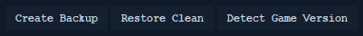
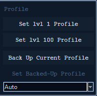
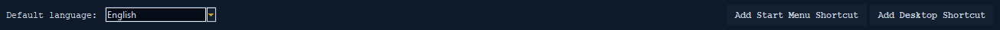

# Settings Tab

The **Settings** tab is where you tell the RUSE Mod Manager where your game is,
make the safety backup that every mod job needs, and set up the app itself
(language and Windows shortcuts). Almost everything else in the app depends on
one value you set here: the **Game Root Directory** (the folder your game is
installed in).

The tab is split top to bottom into four parts:

1. **Paths** — where the game and the app's own files are.
2. **Game File Backup** — make and restore a clean copy of your game files.
3. **Profile** — quick presets and backup/restore for your in-game player profile.
4. **Output Folder Structure** + **Accessibility** — a reminder of where files
   go, plus language and shortcut options.

See also: [Versions & Backups](versions-and-backups.md) ·
[Profiles](profiles.md) · [Mod Manager](mod-manager.md) ·
[Project README](../../README.md)


---

## Paths



This part has three rows. Only the first one can be edited. The other two are
filled in by the app on their own, based on where the app is running. They're
shown read-only so you can read and copy them, but not change them.

| Field | Editable | What it is | Button |
|-------|----------|------------|--------|
| **Game Root Directory** | Yes | The main folder of your R.U.S.E. install — the one with `Ruse.exe` and the `Data/` folder in it. **Everything depends on this.** | **Browse…** |
| **Working Directory** | No (read-only) | Where the app itself lives. All the app's output and saved files go here (under `output/`). Set to the app's own folder on its own. | **Open…** |
| **Mods Folder** | No (read-only) | Where your `.rmod` files are kept: `<working dir>\mods`. Worked out from the working directory. | **Open…** |

### Game Root Directory

This is the only path you set by hand, and it's the most important value in the
whole app. The backup, install, restore, and every editor read from and write to
this folder. So it has to point at a real R.U.S.E. install — the folder that has
both `Ruse.exe` and the `Data/` folder inside it.

There are two ways to set it:

- **Browse…** — opens a folder picker titled *"Select R.U.S.E. game root
  (contains Ruse.exe)"*. Go to your install folder and confirm.
- **Detect Game Version** (in the Game File Backup part below) — finds your
  install through Steam on its own and fills in this field for you. This is the
  easy, recommended way. See [below](#detect-game-version).

The app **never has a game path built into it.** It always finds your install
through Steam, or uses what you typed here. When you change this field, the app
waits a moment, then quietly saves the new value and re-checks the setup
checklist and the build it found. A short *"Settings saved."* message pops up.

> **Tip:** If the field is empty or the path no longer exists (say the drive was
> unplugged), the app checks Steam about every 15 seconds and will quietly find
> and fill in your install for you.

### Working Directory (read-only)

This is the folder the Mod Manager runs from. It's set for you to the app's own
spot — you don't (and can't) change it here. It's the parent of everything the
app makes: `output/backups/`, `output/mod_output_files/`, and your `mods/`
folder.

- **Open…** — makes the folder if it needs to, then opens it in Windows Explorer.
  This is view-only. It does **not** change the path.

### Mods Folder (read-only)

The folder where your `.rmod` files are kept: `<working dir>\mods`. It comes from
the working directory and is shown read-only.

- **Open…** — opens it in Explorer (making it first if it isn't there yet, since
  the mods folder may not exist until you first convert or scan).

---

## Game File Backup



This part is the safety net for the whole app. Before you ever install a mod, you
make a full copy of your original game files here. That way any change can always
be undone. The three buttons sit on the left. The **Profile** tools are on the
right (see the next part).

> **Backups are required.** You can't install mods, and the editors won't open a
> project, until a clean backup for your installed build exists. The editors
> always load *clean* files from the backup — never from your live game, which
> may already have mods in it.

### Create Backup

Copies the whole `Data/` **and** `Maps/` folders out of your game root and into a
backup folder. The `Maps/` folder (with the world and minimap data for each map)
is big, so this can take a little while. Progress is logged file by file.

Steps:

1. Make sure **Game Root Directory** is set and points at a folder with `Data/`
   in it.
2. Click **Create Backup**.
3. If a backup already exists for this build, you'll be asked whether to
   **overwrite** it. Saying yes removes the old one and copies fresh.
4. Wait for *"Backup complete: N files."* in the log.

The backup is stored **per game build** at:

```
output/backups/v<buildid>/
```

Keeping it per build means each game version you've installed gets its own
untouched backup. The app **never deletes or moves a backup on its own** — older,
branch-named backups are left right where they are. (The **Create Backup** button
stays off until a valid Game Root is set.)

### Restore Clean

Puts your game back to the backup, removing any installed mods. It copies the
original `Data/` and `Maps/` files from the backup folder back over your install,
then clears the changed-file output so nothing counts as installed anymore.

Steps:

1. Click **Restore Clean** (off until a backup exists).
2. Confirm the prompt: *"Copy original backup files back into the game (Data and
   Maps), removing any deployed mods. Proceed?"*
3. Wait for *"Restored N files — game is clean."*

Only `Data/` and `Maps/` are put back. Stray files at the top of the backup
folder (like timestamped `.bak` copies from an earlier deploy) are left alone on
purpose.

### Detect Game Version

Finds your R.U.S.E. install through Steam, says which build it is, then fills in
the **Game Root Directory** for you.

- Click **Detect Game Version**.
- If **nothing** is found, you'll be told to make sure the game is installed and
  that Steam has been run at least once.
- If **two** versions are found (like the standard public build and the older
  COMPAT build), you'll be asked which one to use.
- The chosen path is written into the Game Root field, which kicks off the usual
  save and build-detection steps.

Because the backup, mods, and install folders are all kept per build, running
detection is the cleanest way to be sure you're working against the right
version. See [Versions & Backups](versions-and-backups.md) for how builds shape
the folder layout.

---

## Profile



On the right side of the Game File Backup part are tools for your **in-game
player profile** (your level, unlocks, and so on). They're listed here in short;
for the full story see the [Profiles guide](profiles.md).

- **Set lvl 1 Profile** — applies an OG-compat preset that resets your profile to
  level 1.
- **Set lvl 100 Profile** — applies an OG-compat preset for a fully-leveled
  profile.
- **Back Up Current Profile** — saves your current profile so you can bring it
  back later. (Off until it applies.)
- **Set Backed-Up Profile** — brings back a profile you saved before. (Off until
  a backup exists.)
- **Auto / version dropdown** — picks *which* saved profile **Set Backed-Up
  Profile** uses: **Auto** (the newest one that fits, the default) or a specific
  version you choose.

---

## Output Folder Structure

A reminder of where the app writes things, all inside your Working Directory:

| Path | What's in it |
|------|----------|
| `output/backups/v<buildid>/` | Your original game files (made by **Create Backup**), one set per build. |
| `output/mod_output_files/` | The changed `.dat` files, made each time you **Deploy**. |
| `mods/v<buildid>/` | Your `.rmod` files (made by the Convert tab), one folder per build. |

The `v<buildid>` in the paths keeps every game version cleanly apart, so a backup
or mod for one version can never be mixed up with another. See
[Versions & Backups](versions-and-backups.md).

---

## Accessibility



At the bottom of the tab are the app's own ease-of-use options.

### Default language

Sets the language used by default when you edit in-game text (like unit names).
You can still pick a different language for each edit inside the editors — this
just sets the default one. English is the game's main language.

The dropdown lists every fully-translated language:

- English
- French
- German
- Italian
- Spanish
- Polish
- Czech
- Russian
- Japanese
- Chinese (Simplified)

(plus a *Dev / default* entry used while making the app).

Picking a new language saves right away, then asks if you want to **restart now**.
The app's screens are built once in the chosen language when it starts, so a
restart is needed to change them everywhere:

1. Pick a language from the dropdown.
2. Confirm *"The interface language changes when the Mod Manager restarts.
   Restart now?"*
3. The app restarts in the new language. Your other settings are saved first.

### Add Start Menu Shortcut / Add Desktop Shortcut

The two buttons on the right make a Windows shortcut (`.lnk`) to the Mod Manager:

- **Add Start Menu Shortcut** — puts the shortcut in your Start Menu's *Programs*
  folder.
- **Add Desktop Shortcut** — puts it on your Desktop.

The shortcut is named *"R.U.S.E. Mod Manager"* and points at the app's program
file. If it works, you'll see a message with the path it made. If it fails, the
error is shown so you can figure out why.

---

## Quick reference

| I want to… | Do this |
|------------|---------|
| Point the app at my game | Set **Game Root Directory** (Browse… or Detect Game Version) |
| Find my install automatically | **Detect Game Version** |
| Make my mods undoable | **Create Backup** (needed before installing) |
| Undo all mods | **Restore Clean** |
| Open the app's output folder | **Working Directory → Open…** |
| Open my `.rmod` folder | **Mods Folder → Open…** |
| Change the app's language | **Default language** (asks for a restart) |
| Add a launcher icon | **Add Start Menu / Desktop Shortcut** |

---

**Related guides:** [Versions & Backups](versions-and-backups.md) ·
[Profiles](profiles.md) · [Mod Manager](mod-manager.md) ·
[Project README](../../README.md)
