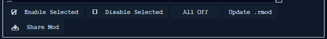

# Sharing Your Mods

Made a mod you want everyone to have? You can send your `.rmod` to the shared
mod pack. Once it's accepted, it gets built into the app, so **every player
gets it automatically**. The Mod Manager has a button that does the hard part
for you — you don't need to know anything about GitHub.

*Select your mod, then click Share Mod.*

See also: [Mod Manager](mod-manager.md) ·
[Versions & Backups](versions-and-backups.md) ·
[Project README](../../README.md)

---

## The easy way — the Share Mod button

1. Open the **Mod Manager** tab.
2. Click your mod in the list to select it. (You can share your own mods — the
   built-in ones are already in the pack, so their button stays greyed out.)
3. Click **📤 Share Mod**.
4. Two things open for you:
   - Your **web browser** opens GitHub's upload page — already pointed at the
     right folder for your game version.
   - The mod's **folder** opens with your file highlighted, ready to grab.
5. **Drag your `.rmod`** from the folder onto the web page.
6. Click **Propose changes**. GitHub may first ask you to sign in or make a free
   account — that's normal.

That's it. You've sent it in.

> **You'll need a free GitHub account.** Behind the scenes GitHub makes your own
> copy of the project to hold your file — you don't have to understand any of
> that. Just drag, and click **Propose changes**.

## What happens next

A maintainer looks over your mod. If they have a question, they'll leave a
comment on your request — so check back after you send it. Once it's accepted,
the **next build of the app includes your mod** and ships it to everyone.

## Which game version does it go to?

You don't have to choose — the app already knows which game version (build) your
mod is for and picks the matching folder for you. If it can't tell, it'll say
so; make sure your game is detected in **Settings**, then try again.

## Doing it by hand (optional)

If you'd rather not use the button, you can add the file yourself on GitHub:

1. Go to the project's `source/example_mods/` folder.
2. Open the folder that matches your game version — for example `v24003166` for
   the normal, up-to-date game (**public**). You'll see the folders listed
   there.
3. Upload your `.rmod` into that folder and open a pull request.

The **Share Mod** button just does these steps for you.
